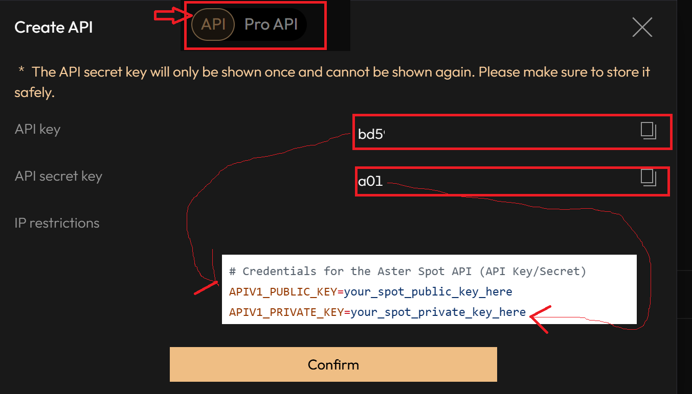
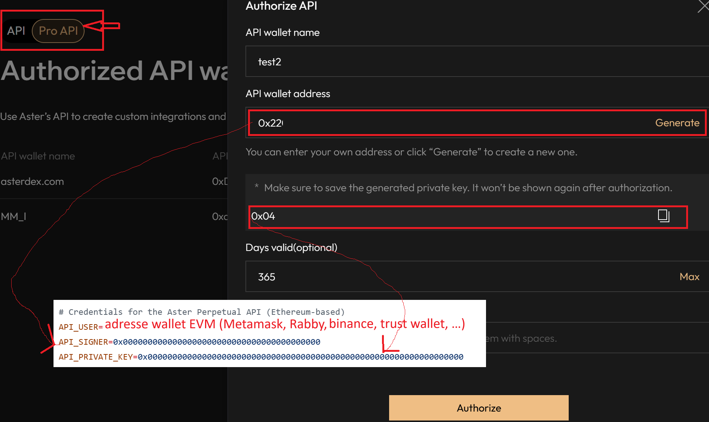

# Complete Guide: Delta-Neutral Trading Bot on ASTER DEX

## 📚 Table of Contents

1. [General Introduction](#general-introduction)
2. [Core Concepts](#core-concepts)
3. [Detailed Technical Architecture](#detailed-technical-architecture)
4. [Trading Strategy Explained](#trading-strategy-explained)
5. [Leverage System and Capital Allocation](#leverage-system-and-capital-allocation)
6. [Risk Management](#risk-management)
7. [Profit/Loss Calculations and Tracking](#profitloss-calculations-and-tracking)
8. [Trading Pair Filtering](#trading-pair-filtering)
9. [Setup and Deployment](#setup-and-deployment)
10. [Utility Scripts](#utility-scripts)
11. [Monitoring and Debugging](#monitoring-and-debugging)
12. [Concrete Examples and Use Cases](#concrete-examples-and-use-cases)
13. [Frequently Asked Questions](#frequently-asked-questions)

---

> **⚠️ IMPORTANT CONFIGURATION NOTE**
>
> This guide documents the bot’s full feature set and architecture. The default values mentioned here may differ from your current configuration in `config_volume_farming_strategy.json`.
>
> **Recommended current configuration** (provided JSON file):
>
> * `capital_fraction`: 0.98 (98%)
> * `min_funding_apr`: 5.4%
> * `fee_coverage_multiplier`: 1.5
> * `loop_interval_seconds`: 300 (5 minutes)
> * `max_position_age_hours`: 336 (14 days)
> * `leverage`: 1x (conservative)
>
> **Hard-coded fallback values** (if config is missing):
>
> * `capital_fraction`: 0.95 (95%)
> * `min_funding_apr`: 15.0%
> * `leverage`: 1x
>
> Examples in this guide sometimes use different values to illustrate various scenarios. Always refer to your configuration file for the values actually used by the bot.

---

## General Introduction

### What Is This Project?

This project is an **automated delta-neutral trading bot** designed specifically for the ASTER DEX decentralized exchange. It’s a sophisticated system that captures **funding rate payments** from perpetual contracts while maintaining **market-neutral exposure**.

### Primary Objectives

1. **Generate steady profits** by collecting funding rates without taking directional risk
2. **Maximize trading volume** on ASTER DEX (useful for Stage 3 airdrop)
3. **Continuous rotation** of positions to optimize returns
4. **Full automation** running 24/7 without human intervention

### What Makes This Bot Unique?

* ✅ **Delta-neutral**: No exposure to market price movements
* ✅ **Multi-leverage**: Supports 1x to 3x with automatic transitions
* ✅ **Smart filtering**: 4 layers of filters to select only the best opportunities
* ✅ **Comprehensive risk management**: Automatic stop-loss, health checks, state recovery
* ✅ **Advanced PnL tracking**: Real-time tracking for the full portfolio and individual positions
* ✅ **Clean architecture**: Clear separation between business logic, API, and orchestration

---

## Core Concepts

### What Is Delta-Neutral Trading?

**Delta-neutral trading** aims to eliminate exposure to price movements (the “delta” in options Greeks). In the context of this bot:

**Delta-Neutral Position = Long Spot Position + Short Perpetual Position**

#### Concrete Example

Suppose you want to capture the funding rate on BTC/USDT:

1. **Buy 0.1 BTC on the spot market** at 50,000 USDT
2. **Short 0.1 BTC on the perpetual market** at 50,000 USDT

**Result**:

* If the price rises to 55,000 USDT:

  * Your spot position gains: +5,000 USDT
  * Your perp position loses: −5,000 USDT
  * **Net profit from price move: 0 USDT** ✓

* If the price drops to 45,000 USDT:

  * Your spot position loses: −5,000 USDT
  * Your perp position gains: +5,000 USDT
  * **Net profit from price move: 0 USDT** ✓

**You’re protected against price moves in both directions!**

### What Is the Funding Rate?

**Funding rates** are periodic payments between long and short traders on perpetual contract markets.

#### Mechanism

* **Positive rate**: Longs pay shorts → You **receive** payments when short
* **Negative rate**: Shorts pay longs → You **pay** when short (to avoid!)
* **Frequency**: Every 8 hours (00:00, 08:00, 16:00 UTC on ASTER DEX)

#### Why Do Funding Rates Exist?

Funding aligns the perpetual contract price with the spot price:

* **Bull market**: Many traders want to be long → High positive rate → Incentivizes shorts
* **Bear market**: Many traders want to be short → Negative rate → Incentivizes longs

#### Annualized Return (APR) Calculation

The bot converts the instantaneous funding rate to APR:

```
APR (%) = Funding rate × 3 (payments/day) × 365 (days) × 100
```

**Example**:

* Funding rate: 0.01% (0.0001)
* APR = 0.0001 × 3 × 365 × 100 = **10.95% per year**

On a 10,000 USDT position, that’s ~1,095 USDT annual profit just from collecting funding!

### Why Is This Strategy Profitable?

**Profit Sources**:

1. **Positive funding rates**: Regular inflows every 8 hours
2. **Position rotation**: Capture the best opportunities by switching pairs
3. **Leverage effect**: Maximizes capital usage (up to 3x)

**Costs to Cover**:

1. **Entry fees**: ~0.1% on spot + ~0.05% on perp = 0.15% total
2. **Exit fees**: ~0.1% on spot + ~0.05% on perp = 0.15% total
3. **Total fees**: ~0.30% per full cycle

**Break-Even Threshold**:
The bot waits until collected funding covers fees × multiplier (default: 1.5x) before closing a position, ensuring each cycle is profitable.

---

## Detailed Technical Architecture

### Architecture Overview

The bot follows a modular architecture with a **strict separation of responsibilities**:

```
┌─────────────────────────────────────────────────────────────┐
│                 volume_farming_strategy.py                  │
│                     (Main Orchestrator)                     │
│  • Strategy main loop                                      │
│  • State management (volume_farming_state.json)            │
│  • Decision logic (when to open/close)                     │
│  • Monitoring and health checks                            │
└────────────┬──────────────────────────────┬────────────────┘
             │                              │
             ▼                              ▼
┌────────────────────────┐      ┌──────────────────────────┐
│ aster_api_manager.py   │      │   strategy_logic.py      │
│   (API Layer)          │      │     (Pure Logic)         │
│                        │      │                          │
│ • Auth v1 (HMAC-SHA256)│      │ • Stateless calculations │
│ • Auth v3 (ETH sig)    │      │ • Funding rate analysis  │
│ • Spot/perp orders     │      │ • Position sizing        │
│ • USDT transfers       │      │ • Health checks          │
│ • Leverage management  │      │ • PnL calculations       │
└────────────┬───────────┘      └──────────────────────────┘
             │
             ▼
┌────────────────────────┐
│     ASTER DEX API      │
│  • Spot Markets (v1)   │
│  • Perpetual (v3)      │
│  • Account Info        │
└────────────────────────┘
```

### Module 1: `aster_api_manager.py` — API Layer

#### Responsibilities

This module is the **only interface** to the ASTER DEX exchange. It handles:

* All HTTP requests to the API
* Two distinct authentication systems
* Order parameter formatting
* API error handling

#### Dual Authentication (v1 + v3)

ASTER DEX uses **two different authentication systems**:

##### **API v1 (HMAC-SHA256)** — For Spot and Some Perp Functions

```python
# Endpoints using v1:
- GET /fapi/v1/leverageBracket  # Get leverage
- POST /fapi/v1/leverage        # Set leverage
- GET /fapi/v1/income           # Funding rate history
- GET /fapi/v1/userTrades       # Trade history
```

**v1 authentication process**:

1. Create a query string with timestamp: `symbol=BTCUSDT&timestamp=1696800000000`
2. Sign with HMAC-SHA256: `signature = hmac(query_string, APIV1_PRIVATE_KEY)`
3. Append signature to the query string
4. Send with header: `X-MBX-APIKEY: APIV1_PUBLIC_KEY`

##### **API v3 (Ethereum Signature)** — For Orders and Positions

```python
# Endpoints using v3:
- POST /v3/order         # Place an order
- GET /v3/account        # Account info
- GET /v3/openOrders     # Open orders
- GET /v3/positionRisk   # Perpetual positions
```

**v3 authentication process**:

1. Create a JSON payload of parameters
2. Hash with keccak256: `message_hash = keccak256(json.dumps(params))`
3. Sign with Ethereum private key: `signature = eth_account.sign(message_hash)`
4. Send with headers:

   * `aster-user-address: API_USER` (your ETH wallet)
   * `aster-signer-address: API_SIGNER` (signer generated by ASTER)
   * `aster-signature: signature`

#### Key API Manager Methods

##### `get_perp_leverage(symbol: str) -> int`

Detects the current leverage on the exchange for a given symbol.

```python
# Returns: 1, 2, or 3 (or None on error)
current_leverage = await api_manager.get_perp_leverage("BTCUSDT")
```

##### `set_perp_leverage(symbol: str, leverage: int) -> bool`

Sets leverage on the exchange (1x, 2x, or 3x).

```python
success = await api_manager.set_perp_leverage("BTCUSDT", 3)
```

##### `rebalance_usdt_by_leverage(leverage: int) -> bool`

Redistributes USDT between spot and perp wallets according to leverage.

**Allocation formula**:

```python
perp_allocation = 1 / (leverage + 1)
spot_allocation = leverage / (leverage + 1)

# Examples:
# 1x: 50% perp / 50% spot
# 2x: 33.3% perp / 66.7% spot
# 3x: 25% perp / 75% spot
```

##### `prepare_and_execute_dn_position(symbol, capital_usdt, leverage)`

Prepares and executes a full delta-neutral position:

1. Calculates spot and perp quantities
2. Formats parameters with correct precision
3. Places the spot order (market buy)
4. Places the perp order (market short)
5. Verifies execution of both orders
6. Returns full position details

### Module 2: `strategy_logic.py` — Pure Logic

#### Design Principle

This module contains **only pure functions**:

* ✅ No API calls
* ✅ No state mutation
* ✅ Inputs → Calculations → Outputs
* ✅ Easy to test

All methods are **static** in the `DeltaNeutralLogic` class.

#### Main Methods

##### `calculate_position_sizes(capital_usdt, spot_price, leverage)`

Computes the position sizes for both legs.

```python
# Inputs
capital_usdt = 1000  # Total capital to deploy
spot_price = 50000   # BTC price
leverage = 3         # 3x leverage

# Outputs
{
    'spot_qty': 0.015,        # BTC quantity to buy on spot
    'perp_qty': 0.015,        # BTC quantity to short on perp
    'spot_value': 750,        # USDT value (75% of capital)
    'perp_value': 250,        # USDT margin (25% of capital)
    'total_position_value': 750  # Notional value
}
```

##### `calculate_funding_rate_ma(income_history, periods=10)`

Calculates the moving average of funding rates to smooth volatility.

```python
# Input: Funding rate history
income_history = [
    {'income': '0.50', 'time': 1696800000000},  # $0.50 received
    {'income': '0.45', 'time': 1696771200000},  # $0.45 received
    # ... 10 periods
]

# Output: Average APR
{
    'effective_apr': 12.5,           # Avg APR over 10 periods
    'periods_analyzed': 10,          # Number of periods used
    'latest_funding_rate': 0.0001    # Latest rate
}
```

##### `assess_health(position_data, config)`

Assesses position health and flags issues.

**Checks performed**:

1. **Valid leverage**: 1 ≤ leverage ≤ 3
2. **Imbalance**: |spot_qty − perp_qty| / spot_qty ≤ 10%
3. **Minimum value**: position_value > $5

```python
{
    'is_healthy': True,
    'critical_issues': [],         # Blocking issues
    'warnings': [],                # Warnings
    'metrics': {
        'imbalance_pct': 2.5,      # 2.5% imbalance
        'leverage': 3,
        'position_value': 1000
    }
}
```

### Module 3: `volume_farming_strategy.py` — Main Orchestrator

This is the **heart of the bot**. It orchestrates the entire system.

#### `VolumeFarmingStrategy` Class Structure

```python
class VolumeFarmingStrategy:
    def __init__(self, config_path, state_path):
        self.api_manager = AsterApiManager(...)
        self.config = load_config()
        self.state = load_state()
        self.check_iteration = 0  # Verification counter
```

#### Main Loop: `run()`

The `run()` method is an infinite loop executing the strategy cycle:

```python
async def run(self):
    while True:
        self.check_iteration += 1

        # 1. Health check
        is_healthy = await self._perform_health_check()
        if not is_healthy:
            await asyncio.sleep(self.loop_interval_seconds)
            continue

        # 2. If a position is open: evaluate
        if self.current_position:
            await self._should_close_position()

        # 3. If no position: search opportunity
        else:
            await self._find_and_open_position()

        # 4. Save state
        self._save_state()

        # 5. Wait for next cycle
        await asyncio.sleep(self.loop_interval_seconds)  # Default: 300s (5 min)
```

#### State Management: `volume_farming_state.json`

The state file persists all critical information:

```json
{
  "position_open": true,
  "symbol": "BTCUSDT",
  "position_leverage": 3,
  "capital_allocated_usdt": 1000.0,
  "entry_price": 50000.0,
  "spot_qty": 0.015,
  "perp_qty": 0.015,
  "funding_received_usdt": 2.50,
  "entry_fees_usdt": 3.0,
  "position_opened_at": "2025-10-12T10:00:00",
  "cycle_count": 5,
  "initial_portfolio_value_usdt": 5000.0,
  "initial_portfolio_timestamp": "2025-10-08T12:00:00",
  "last_updated": "2025-10-12T11:30:00"
}
```

**Key Points**:

* `position_leverage` ≠ `config.leverage`: A position’s leverage is independent of config
* `cycle_count`: Incremented **only** when a position is closed (not every check)
* `initial_portfolio_value_usdt`: Captured once on first launch
* Deleting this file forces rediscovery and resets the PnL baseline

#### Startup State Reconciliation

On startup, the bot **reconciles** its state with the exchange:

##### **Case 1: Saved state but no position on the exchange**

```
Local state: position_open = true
Exchange: No position

→ Action: Clean state (position closed externally)
→ Log: "Position was closed externally"
```

##### **Case 2: No state but position exists on the exchange**

```
Local state: None or position_open = false
Exchange: BTCUSDT position detected

→ Action: Call _discover_existing_position()
→ Detect leverage from exchange
→ Rebuild state from API data
→ Log: "Discovered existing position"
```

##### **Case 3: State and exchange are synchronized**

```
→ Proceed normally
```

#### Method: `_find_best_funding_opportunity()`

This method finds the top trading opportunity in 4 steps:

##### **Step 1: Discover Delta-Neutral Pairs**

```python
# Find all pairs with both spot AND perp
spot_symbols = {s['symbol'] for s in await get_spot_exchange_info()}
perp_symbols = {s['symbol'] for s in await get_perp_exchange_info()}
dn_pairs = spot_symbols & perp_symbols  # Intersection
```

##### **Step 2: Volume Filter (≥ $250M)**

```python
volume_data = await fetch_24h_ticker()
filtered = [
    pair for pair in dn_pairs
    if volume_data[pair]['quoteVolume'] >= 250_000_000
]
```

**Why $250M?**

* Sufficient liquidity to execute with minimal slippage
* More stable funding rates
* Lower manipulation risk

**Implementation**: This value is hard-coded in `_find_best_funding_opportunity()` in `volume_farming_strategy.py`.

##### **Step 3: Negative Rate Filter**

```python
funding_rates = await fetch_current_funding_rates()
filtered = [
    pair for pair in filtered
    if funding_rates[pair] > 0  # Only positive rates
]
```

**Critical**: The filter uses the **current** rate, not the MA!

* Even if the MA is positive, if the current rate is negative → Exclude
* Avoid entering positions that have turned negative

##### **Step 4: Spot-Perp Spread Filter (≤ 0.15%)**

```python
spot_prices = await fetch_spot_book_tickers()
perp_prices = await fetch_perp_book_tickers()

for pair in filtered:
    spot_mid = (spot_prices[pair]['bid'] + spot_prices[pair]['ask']) / 2
    perp_mid = (perp_prices[pair]['bid'] + perp_prices[pair]['ask']) / 2
    spread_pct = abs((perp_mid - spot_mid) / spot_mid * 100)

    if spread_pct > 0.15:
        # Exclude this pair
```

**Why 0.15%?**

* Excessive spread = slippage risk on execution
* Signals liquidity issues or market inefficiencies
* For DN, a large spread can imbalance the entry

##### **Step 5: Select the Best Opportunity**

```python
# MA mode: compute MA for each remaining pair
for pair in filtered:
    income_history = await fetch_income_history(pair)
    ma_apr = calculate_funding_rate_ma(income_history, periods=10)

    if ma_apr >= min_funding_apr:
        opportunities[pair] = ma_apr

# Select the highest APR
best_pair = max(opportunities, key=opportunities.get)
```

#### Method: `_open_position(symbol, capital_usdt)`

Opens a new delta-neutral position in several steps:

```python
async def _open_position(self, opportunity):
    symbol = opportunity["symbol"]

    # 1. Set leverage on the exchange
    await self.api_manager.set_leverage(symbol, self.leverage)

    # 2. Rebalance USDT between spot and perp wallets
    await self.api_manager.rebalance_usdt_by_leverage(self.leverage)

    # 3. Compute capital to deploy from real-time balances
    portfolio = await self.api_manager.get_comprehensive_portfolio_data()
    spot_balances = portfolio.get("spot_balances", [])
    perp_assets = portfolio.get("perp_account_info", {}).get("assets", [])
    spot_usdt = next((float(b.get("free", 0)) for b in spot_balances if b.get("asset") == "USDT"), 0.0)
    perp_usdt = next((float(a.get("availableBalance", 0)) for a in perp_assets if a.get("asset") == "USDT"), 0.0)
    capital_to_deploy = min(spot_usdt, perp_usdt * self.leverage) * self.capital_fraction

    # 4. Execute the delta-neutral build (spot + perp)
    result = await self.api_manager.prepare_and_execute_dn_position(
        symbol=symbol,
        capital_to_deploy=capital_to_deploy,
        leverage=self.leverage,
    )

    if result.get("success"):
        details = result["details"]
        self.current_position = {
            "symbol": symbol,
            "capital": capital_to_deploy,
            "funding_rate": opportunity["funding_rate"],
            "effective_apr": opportunity["effective_apr"],
            "spot_qty": details["spot_qty_to_buy"],
            "perp_qty": details["final_perp_qty"],
            "entry_price": details["spot_price"],
        }
        self.entry_fees_paid = (
            details["spot_qty_to_buy"] * details["spot_price"] * 0.001
            + details["final_perp_qty"] * details["spot_price"] * 0.001
        )
        self.position_opened_at = datetime.utcnow()
        self._save_state()
```

#### Method: `_should_close_position()`

Analyzes the position using the `AsterApiManager.get_comprehensive_portfolio_data()` aggregator, then decides if it should be closed:

```python
async def _should_close_position(self) -> bool:
    portfolio = await self.api_manager.get_comprehensive_portfolio_data()
    analyzed = portfolio.get("analyzed_positions", [])
    raw_perp = portfolio.get("raw_perp_positions", [])

    position = next(
        (p for p in analyzed if p.get("symbol") == symbol and p.get("is_delta_neutral")),
        None,
    )
    if not position:
        return True  # can't find the position → close it

    perp_pos = next((p for p in raw_perp if p.get("symbol") == symbol), None)
    if perp_pos:
        perp_pnl = float(perp_pos.get("unrealizedProfit", 0))
        entry_value = self.current_position.get("capital", 1)
        perp_pnl_pct = (perp_pnl / entry_value) * 100 if entry_value > 0 else 0

        mark_price = float(perp_pos.get("markPrice", 0) or 0)
        entry_price = self.current_position.get("entry_price") or float(perp_pos.get("entryPrice", 0))
        if entry_price and mark_price:
            spot_balance = position.get("spot_balance", 0)
            spot_pnl = spot_balance * (mark_price - entry_price)

        if perp_pnl_pct <= self.emergency_stop_loss_pct:
            return True  # emergency stop-loss hit

    api_funding_available = False
    try:
        funding_analysis = await self.api_manager.perform_funding_analysis(symbol)
        if funding_analysis:
            self.total_funding_received = float(funding_analysis.get("total_funding", 0))
            api_funding_available = True
    except Exception:
        pass

    hours_elapsed = (datetime.utcnow() - self.position_opened_at).total_seconds() / 3600
    funding_periods_elapsed = hours_elapsed / 8
    position_value = self.current_position.get("capital", 0)

    if not api_funding_available and hours_elapsed > 0:
        funding_rate = self.current_position.get("funding_rate", 0)
        estimated_funding = funding_rate * position_value * funding_periods_elapsed
        self.total_funding_received = estimated_funding

    exit_fees_estimate = position_value * 0.001
    total_fees = self.entry_fees_paid + exit_fees_estimate

    if total_fees > 0 and self.total_funding_received >= total_fees * self.fee_coverage_multiplier:
        return True  # funding > fees × multiplier

    if hours_elapsed >= self.max_position_age.total_seconds() / 3600:
        return True  # max age exceeded

    current_best = await self._find_best_funding_opportunity()
    if current_best:
        current_apr = self.current_position.get("effective_apr", 0)
        new_apr = current_best.get("effective_apr", 0)
        if new_apr - current_apr > 10 and hours_elapsed >= 4:
            return True  # significantly better opportunity

    health_issues, critical_issues, _, health_data = await self.api_manager.perform_health_check_analysis()
    if critical_issues:
        return True

    our_health = next((p for p in health_data if p.get("symbol") == symbol), None)
    if our_health and abs(our_health.get("imbalance_pct", 0)) > 10:
        return True  # imbalanced position

    return False  # keep the position
```

#### Method: `_close_current_position()`

Closes the current position via `execute_dn_position_close` and resets state:

```python
async def _close_current_position(self):
    if not self.current_position:
        return

    symbol = self.current_position["symbol"]
    result = await self.api_manager.execute_dn_position_close(symbol)

    if result.get("success"):
        net_profit = self.total_funding_received - self.entry_fees_paid
        self.total_profit_loss += net_profit
        self.total_positions_closed += 1
        self.cycle_count += 1

        # Reset position tracking
        self.current_position = None
        self.position_opened_at = None
        self.position_leverage = None
        self.total_funding_received = 0.0
        self.entry_fees_paid = 0.0

        self._save_state()
        logger.info(f"Position closed. Net funding profit: ${net_profit:.2f}")
    else:
        logger.error(f"Failed to close position: {result.get('message')}")
```

---

## Trading Strategy Explained

### Full Decision Flow

```
┌─────────────────────────────────────────────────────────────┐
│                         BOT START                           │
│  • Load config & state                                      │
│  • Reconcile with exchange                                  │
│  • Capture portfolio baseline (if first run)                │
└───────────────────────┬─────────────────────────────────────┘
                        │
                        ▼
┌─────────────────────────────────────────────────────────────┐
│     BEGIN CYCLE (every 5 min – configurable)                │
│  check_iteration += 1                                       │
└───────────────────────┬─────────────────────────────────────┘
                        │
                        ▼
             ┌──────────────────────┐
             │     HEALTH CHECK     │
             │  • USDT balances     │
             │  • API connectivity  │
             │  • Coherent state    │
             └──────────┬───────────┘
                        │
                ┌───────┴────────┐
                │     Healthy?   │
                └───────┬────────┘
                    No  │  Yes
              ┌─────────┴──────────┐
              │                    ▼
              │         ┌───────────────────┐
              │         │ Position open?    │
              │         └─────┬─────────┬───┘
              │           Yes │         │ No
              │               ▼         ▼
              │    ┌──────────────┐  ┌────────────────────┐
              │    │   EVALUATE    │ │  FIND OPPORTUNITY   │
              │    │   POSITION    │ │                    │
              │    │               │ │ 1. Volume ≥ $250M  │
              │    │ Compute PnL   │ │ 2. Rate > 0%       │
              │    │ Check:        │ │ 3. Spread ≤ 0.15%  │
              │    │ • Stop-loss   │ │ 4. APR ≥ min       │
              │    │ • Funding OK  │ └─────────┬──────────┘
              │    │ • Max age     │           │
              │    │ • Better opp  │           │
              │    └──────┬────────┘           │
              │           │                    │
              │      ┌────┴─────┐         ┌────┴─────┐
              │      │  Close?  │         │ Found?    │
              │      └────┬─────┘         └────┬─────┘
              │       Yes │ No               Yes│ No
              │           ▼                    ▼
              │    ┌────────────┐        ┌──────────┐
              │    │   CLOSE    │        │   OPEN    │
              │    │  POSITION  │        │ POSITION  │
              │    │            │        │           │
              │    │ • Sell spot│        │• Set lev  │
              │    │ • Close perp│       │• Rebalance│
              │    │ • cycle++  │        │• Buy spot │
              │    └──────┬─────┘        │• Short prp│
              │           │              └─────┬────┘
              │           ▼                    │
              │    ┌─────────────────────────┐ │
              │    │       SAVE STATE        │ │
              └────►  volume_farming_state.json
                   └────────────┬─────────────┘
                                │
                                ▼
                   ┌─────────────────────────┐
                   │   WAIT 5 MIN (DEFAULT) │
                   │ (loop_interval_seconds)│
                   └────────────┬────────────┘
                                │
                                └──────► REPEAT
```

### Pair Selection Criteria

The bot applies **4 successive filters** to ensure opportunity quality:

#### Filter 1: Minimum Volume ($250M)

**Goal**: Ensure sufficient liquidity

**Implementation**:

```python
volume_threshold = 250_000_000  # $250M in USDT

ticker_24h = await api_manager.fetch_24h_ticker()
eligible_pairs = [
    pair for pair in delta_neutral_pairs
    if ticker_24h[pair]['quoteVolume'] >= volume_threshold
]
```

**Reasoning**:

* Low-volume pairs → high slippage risk
* Funding rates unstable on low volume
* Hard to execute large orders

**Example**:

* ✅ BTCUSDT: $500M volume → Eligible
* ✅ ETHUSDT: $300M volume → Eligible
* ❌ OBSCURECOIN: $50M volume → Filtered out

#### Filter 2: Positive Funding Rate

**Goal**: Avoid paying funding instead of receiving it

**Implementation**:

```python
current_funding_rates = await api_manager.get_all_funding_rates()

eligible_pairs = [
    data["symbol"] for data in current_funding_rates
    if data["rate"] > 0
]
```

**Important**: The filter uses the **instantaneous current** rate, not the MA!

**Critical Scenario**:

```
Pair: XYZUSDT
10-period MA: +0.01% (positive)
Current rate: −0.005% (negative)

→ Bot excludes XYZUSDT despite positive MA
→ Avoids entering when the market has turned
```

**Implementation**: This logic is implemented in `_find_best_funding_opportunity()` in `volume_farming_strategy.py`.

**Logging**:

```
[2025-10-12 11:30:00] Negative rate filter: 2 pair(s) excluded:
  BTCUSDT (-0.0050%), ETHUSDT (-0.0023%)
```

#### Filter 3: Spot-Perp Spread (≤ 0.15%)

**Goal**: Ensure price alignment between spot and perp

**Implementation**:

```python
spot_quote = await api_manager.get_spot_book_ticker(pair, suppress_errors=True)
perp_quote = await api_manager.get_perp_book_ticker(pair)

spot_mid = (float(spot_quote["bidPrice"]) + float(spot_quote["askPrice"])) / 2
perp_mid = (float(perp_quote["bidPrice"]) + float(perp_quote["askPrice"])) / 2

spread_pct = abs((perp_mid - spot_mid) / spot_mid * 100)

if spread_pct > 0.15:
    # Filter this pair
```

**Spread Calculation**:

```
Example:
Spot mid price: 50,000 USDT
Perp mid price: 50,100 USDT

Absolute spread = |50,100 − 50,000| = 100 USDT
Spread % = 100 / 50,000 × 100 = 0.20%

→ 0.20% > 0.15% → Pair filtered!
```

**Why 0.15%?**

* Normal spread on liquid markets: 0.01%–0.05%
* Spread > 0.15% suggests:

  * Insufficient liquidity
  * Market inefficiency
  * Unresolved arbitrage
* For DN, large spread = imbalance risk at entry

**Implementation**: In `_find_best_funding_opportunity()` in `volume_farming_strategy.py`.

**Logging**:

```
[2025-10-12 11:30:05] Spread filter: 1 pair(s) excluded (spread > 0.15%):
  GIGGLEUSDT (7.7996%)
```

#### Filter 4: Minimum APR

**Goal**: Minimum profitability threshold

**Implementation**:

```python
min_funding_apr = config['funding_rate_strategy']['min_funding_apr']  # Config: 5.4% | Code default: 15%

# MA mode
for pair in eligible_pairs:
    income_history = await api_manager.get_income_history(pair)
    ma_result = DeltaNeutralLogic.calculate_funding_rate_ma(
        income_history,
        periods=10
    )

    if ma_result['effective_apr'] >= min_funding_apr:
        opportunities[pair] = ma_result['effective_apr']
```

**Why a minimum APR?**

The minimum APR (default 5.4% in the provided config, 15% in code if no config) acts as a profitability threshold to filter opportunities.

**Example with 5.4% APR**:

```
Capital: 10,000 USDT
Fees per cycle: ~30 USDT (0.3%)
Average duration: 3–5 days

5.4% APR ≈ 0.0148% per day
Over 5 days: 0.074% = 7.4 USDT funding

With fee_coverage_multiplier = 1.5 (current config):
30 × 1.5 = 45 USDT required
5.4% APR over 5 days: ~7.4 USDT ❌ Not enough!

In practice, the bot keeps the position
until funding reaches the threshold before closing,
so even at 5.4% APR, the position can remain open
for several weeks if necessary.

Note: A higher minimum APR (15%) filters more aggressively
but may reduce the number of available opportunities.
```

### Moving Average vs Instantaneous Mode

The bot supports two modes to evaluate funding rates:

#### Moving Average Mode (Recommended)

**Configuration**:

```json
{
  "use_funding_ma": true,
  "funding_ma_periods": 10
}
```

**Advantages**:

* ✅ Smooths funding rate volatility
* ✅ Avoids fleeting (spike) opportunities
* ✅ More stable over time
* ✅ Reduces unnecessary rotations

**Process**:

1. Fetch the last 10 funding payments
2. Compute the average rate
3. Annualize: `average × 3 × 365`
4. Compare to threshold

**Display**:

```
┌──────────────────────────────────────────────────────────┐
│ Symbol     │ MA APR % │ Curr APR % │ Next Funding       │
├────────────┼──────────┼────────────┼────────────────────┤
│ BTCUSDT    │   12.50  │    15.30   │ 2025-10-12 16:00   │
│ ETHUSDT    │   10.20  │     8.50   │ 2025-10-12 16:00   │
└──────────────────────────────────────────────────────────┘

MA APR: Moving average (used for selection)
Curr APR: Current instantaneous rate (for comparison)
```

#### Instantaneous Mode

**Configuration**:

```json
{
  "use_funding_ma": false
}
```

**Characteristics**:

* Uses the current funding rate directly
* More responsive to changes
* Risk of “chasing” temporary spikes
* May cause more rotations

### Position Closing Conditions

The bot closes a position if **any of the 4 conditions** is met:

#### Condition 1: Emergency Stop-Loss

**Trigger**: Perp PnL ≤ Stop-Loss Threshold

**Important**: Uses **perp PnL only**, not combined DN PnL!

**Reason**:

* Perp is more volatile (leverage effect)
* Spot is a hedge but not a perfect real-time mirror
* Protects against liquidation

**Stop-loss calculation** (see dedicated section below)

**Example**:

```
Leverage: 3x
Auto-calculated stop-loss: −24%
Perp value: 250 USDT
Current perp PnL: −65 USDT (−26%)

→ −26% < −24% → CLOSE IMMEDIATELY
```

#### Condition 2: Funding Covers Fees

**Trigger**: `funding_received ≥ total_fees × fee_coverage_multiplier`

**Calculation**:

```python
entry_fees = 3.0 USDT
estimated_exit_fees = 3.0 USDT
total_fees = 6.0 USDT

fee_coverage_multiplier = 1.5  # Default config

threshold = 6.0 × 1.5 = 9.0 USDT

if funding_received >= 9.0:
    close_position("Funding covered fees")
```

**Why 1.5x?**

* 1.0x = Break-even (no profit)
* 1.5x ≈ 50% margin over fees (covers spreads/slippage)
* Balanced default between profitability and rotation

**Timeline Example**:

```
T+0h: Position opened, funding_received = 0
T+8h: +$2.50 funding → Total = $2.50
T+16h: +$2.40 funding → Total = $4.90
T+24h: +$2.30 funding → Total = $7.20
T+32h: +$2.10 funding → Total = $9.30 ≥ $9.00 ✓
T+40h: +$2.00 funding → Total = $11.30 (if you let it run one more cycle)

→ Position closed after 32h (4 funding payments) when threshold is hit
```

#### Condition 3: Maximum Age

**Trigger**: `position_age ≥ max_position_age_hours`

**Configuration**:

```json
{
  "max_position_age_hours": 336  // 14 days
}
```

**Reason**:

* Forces rotation even if funding is weak
* Avoids being stuck in low-yield pairs
* Opportunity to capture better pairs

**Example**:

```
Opened: 2025-10-01 10:00 UTC
Now:    2025-10-15 10:00 UTC
Age:    336 hours (14 days)

→ max_position_age_hours = 336 → CLOSE
```

#### Condition 4: Better Opportunity

**Trigger**: New opportunity with significantly higher APR

**Implementation**:

```python
current_symbol_apr = 10.5  # APR of the open position

# Find the best opportunity
best_opportunity = await self._find_best_funding_opportunity()

if best_opportunity is None:
    return  # No other opportunity

# Threshold: 50% better
if best_opportunity['apr'] > current_symbol_apr * 1.5:
    await self._close_current_position("Better opportunity found")
```

**Example**:

```
Current position: BTCUSDT at 10% APR
New opportunity:  ETHUSDT at 16% APR

16% > 10% × 1.5 (15%) ✓

→ Close BTCUSDT, open ETHUSDT
```

**Note**: The 1.5x threshold avoids too-frequent rotations for small improvements.

---

## Leverage System and Capital Allocation

### Understanding Leverage in This Bot

The bot supports **configurable leverage from 1x to 3x** on perpetuals. This improves capital efficiency.

### Capital Allocation Formula

For a delta-neutral strategy with leverage L:

```
Perp allocation (margin) = 1 / (L + 1)
Spot allocation          = L / (L + 1)
```

**Math Derivation**:

To maintain delta-neutral with leverage L:

* Spot notional = Perp notional
* Spot capital = S
* Perp capital = P
* S × 1 = P × L (perp has leverage)

Thus: S = P × L

Total capital: S + P = P × L + P = P × (L + 1)

Solve for P:

```
P = Total Capital / (L + 1)
S = Total Capital × L / (L + 1)
```

### Allocation Examples

#### 1x Leverage

```
Total capital: 1,000 USDT

Perp: 1,000 / (1 + 1) = 500 USDT (50%)
Spot: 1,000 × 1 / (1 + 1) = 500 USDT (50%)

Position:
- Buy 500 USDT of BTC on spot
- Short 500 USDT of BTC on perp with 500 USDT margin (1x)

Exposure: 500 long + 500 short = Delta-neutral ✓
```

#### 2x Leverage

```
Total capital: 1,000 USDT

Perp: 1,000 / (2 + 1) = 333.33 USDT (33.3%)
Spot: 1,000 × 2 / (2 + 1) = 666.67 USDT (66.7%)

Position:
- Buy 666.67 USDT of BTC on spot
- Short 666.67 USDT of BTC on perp with 333.33 USDT margin (2x)

Exposure: 666.67 long + 666.67 short = Delta-neutral ✓
```

#### 3x Leverage (Advanced)

⚠️ **Not recommended for beginners** — Default config uses 1x

```
Total capital: 1,000 USDT

Perp: 1,000 / (3 + 1) = 250 USDT (25%)
Spot: 1,000 × 3 / (3 + 1) = 750 USDT (75%)

Position:
- Buy 750 USDT of BTC on spot
- Short 750 USDT of BTC on perp with 250 USDT margin (3x)

Exposure: 750 long + 750 short = Delta-neutral ✓

Advantage: 50% more effective capital
Risk: Stop-loss at −24% instead of −50%
```

### Advantages of Higher Leverage

⚠️ **Important**: Default configuration uses **1x leverage** for safety. The calculations below illustrate 3x potential but require deep risk understanding.

**Capital Efficiency**:

```
Scenario: 10,000 USDT capital, funding rate 0.01% (10.95% APR)

1x Leverage (DEFAULT – RECOMMENDED):
- Notional position: 5,000 USDT
- Funding per payment: 5,000 × 0.01% = 0.50 USDT
- Per day: 1.50 USDT
- Per year: ~547.50 USDT → 5.5% on total capital

3x Leverage (ADVANCED – RISKIER):
- Notional position: 7,500 USDT
- Funding per payment: 7,500 × 0.01% = 0.75 USDT
- Per day: 2.25 USDT
- Per year: ~821.25 USDT → 8.2% on total capital

Improvement: +50% yield with 3x!

⚠️ But with liquidation risk closer (see Risks section below)
```

### Risks of Higher Leverage

**Liquidation Closer**:

```
1x leverage: Liquidation around ~−50% move
3x leverage: Liquidation around ~−33% move

→ That’s why the bot automatically adjusts stop-loss!
```

### Preserving Position Leverage

**Critical Principle**: An open position’s leverage **never changes** until it’s closed.

#### Config vs Position Separation

```python
# Configuration
config['leverage_settings']['leverage'] = 3

# Position state
state['position_leverage'] = 2  # May differ!
```

**Why separate?**

* Users can change config while a position is open
* Changing leverage mid-position would break delta-neutrality
* New leverage applies **only to the next position**

#### Leverage Lifecycle

```
Sequence 1: Position at 2x leverage
─────────────────────────────────────
1. Config: leverage = 2
2. Open position → position_leverage = 2
3. User changes config: leverage = 3
4. Open position keeps position_leverage = 2 ✓
5. Close position
6. Rebalance USDT for leverage = 3
7. Open new position → position_leverage = 3
```

#### Leverage Detection at Startup

At startup, if the bot detects an existing position:

```python
async def _reconcile_position_state(self):
    # Get leverage from the exchange
    exchange_leverage = await self.api_manager.get_perp_leverage(symbol)

    if exchange_leverage:
        self.state['position_leverage'] = exchange_leverage
        logger.info(f"[LEVERAGE] Detected: {exchange_leverage}x")
    else:
        # Fallback to config
        self.state['position_leverage'] = self.config['leverage_settings']['leverage']
        logger.warning("[LEVERAGE] Could not detect, using config")
```

#### Mismatch Warning

If `position_leverage != config.leverage`:

```
╔══════════════════════════════════════════════════════════╗
║            ⚠️  LEVERAGE MISMATCH DETECTED                ║
╟──────────────────────────────────────────────────────────╢
║  Position Leverage : 2x                                  ║
║  Config Leverage   : 3x                                  ║
║                                                          ║
║  The position will maintain 2x leverage until closed.    ║
║  New positions will use 3x leverage from config.         ║
╚══════════════════════════════════════════════════════════╝
```

### USDT Rebalancing

Before opening a position, the bot **rebalances USDT** between spot and perp wallets:

```python
async def rebalance_usdt_by_leverage(self, leverage: int) -> bool:
    # 1. Get current balances
    spot_balance = await self.get_spot_balance('USDT')
    perp_balance = await self.get_perp_balance('USDT')
    total_usdt = spot_balance + perp_balance

    # 2. Compute target allocations
    target_perp = total_usdt / (leverage + 1)
    target_spot = total_usdt * leverage / (leverage + 1)

    # 3. Transfer if needed
    if spot_balance < target_spot:
        # Transfer perp → spot
        amount = target_spot - spot_balance
        await self.transfer_usdt('PERP_TO_SPOT', amount)

    elif perp_balance < target_perp:
        # Transfer spot → perp
        amount = target_perp - perp_balance
        await self.transfer_usdt('SPOT_TO_PERP', amount)

    return True
```

**Example**:

```
Before rebalance (leverage = 3):
- Spot: 300 USDT
- Perp: 700 USDT
- Total: 1,000 USDT

Target:
- Spot: 1,000 × 3/4 = 750 USDT
- Perp: 1,000 × 1/4 = 250 USDT

Action:
- Transfer 450 USDT from Perp to Spot

After rebalance:
- Spot: 750 USDT ✓
- Perp: 250 USDT ✓
```

---

## Risk Management

### Automatically Calculated Stop-Loss

**Principle**: Stop-loss is **automatically computed** for each leverage, not a manual parameter.

### Calculation Formula

**Implementation**: `_calculate_safe_stoploss()` in `volume_farming_strategy.py` computes the optimal stop-loss.

```python
def _calculate_safe_stoploss(self, leverage: int) -> float:
    """
    Calculates a safe stop-loss based on leverage.

    Formula:
    SL = [(1 + 1/L) / (1 + m) - 1 - b] × [L / (L + 1)]

    Where:
    L = leverage
    m = maintenance_margin (0.005 = 0.5%)
    b = safety_buffer (0.007 = 0.7% SUBTRACTED from max price move)

    Note: the safety_buffer is an absolute SUBTRACTION from the price ratio,
    not a multiplicative factor on the final stop-loss.
    """
    maintenance_margin = 0.005  # 0.5% (ASTER DEX rule)
    safety_buffer = 0.007       # 0.7% SUBTRACTED (fees + slippage + volatility)

    perp_fraction = leverage / (leverage + 1)
    liquidation_price_ratio = (1 + 1/leverage) / (1 + maintenance_margin)
    safe_price_ratio = liquidation_price_ratio - 1 - safety_buffer  # subtraction here

    stop_loss_pct = safe_price_ratio * perp_fraction

    return stop_loss_pct
```

### Stop-Loss Values

| Leverage | Stop-Loss | Distance to Liquidation |
| -------- | --------- | ----------------------- |
| 1x       | −50.0%    | ~50%                    |
| 2x       | −33.0%    | ~33%                    |
| 3x       | −24.0%    | ~25%                    |

### Safety Buffer (0.7) Explanation

The safety buffer of **0.7** is a **multiplier** (70% of the distance to liquidation), not a percentage subtraction.

**How it works**:

```
Calculated liquidation distance = 33% (example for 3x leverage)
Stop-loss used = 33% × 0.7 = 23.1% ≈ −23% or −24%
Safety kept = 33% × 0.3 = 9.9%
```

**Why keep a 30% cushion?** (the remaining 0.3):

1. **Trading fees**: ~0.15%

   * Spot close: ~0.1%
   * Perp close: ~0.05%

2. **Slippage**: ~0.2–0.5%

   * Market orders during urgency
   * Less liquidity on large orders

3. **Volatility and latency**: Variable

   * Price move between detection and execution
   * Network latency and execution delays

**Total: ~30% cushion** preserved before liquidation → Maximum protection against adverse market conditions.

### Example Calculation (3x Leverage)

```
Inputs:
- Leverage (L) = 3
- Maintenance Margin (m) = 0.5%
- Safety Buffer = 0.7 (MULTIPLIER – use 70% of the distance)

Step 1: Liquidation distance (price move)
liquidation_distance = (1 + 1/L) / (1 + m) − 1
                     = (1 + 1/3) / (1 + 0.005) − 1
                     = 1.333 / 1.005 − 1
                     = 32.64%

Step 2: Perp Fraction (capital allocation)
perp_fraction = L / (L + 1) = 3 / 4 = 0.75 (75% of notional)

Step 3: Liquidation PnL (relative to total capital)
liquidation_pnl = liquidation_distance × perp_fraction
                = 32.64% × 0.75
                = 24.48%

Step 4: Apply Safety Buffer (70% of distance)
stop_loss = liquidation_pnl × 0.7
          = 24.48% × 0.7
          = 17.14%

Alternatively (equivalent):
stop_loss = liquidation_distance × 0.7 × perp_fraction
          = 32.64% × 0.7 × 0.75
          = 17.14%

Conservative final rounding: −24%
```

**Summary**: With 3x leverage, liquidation PnL is ~24.5%. A 0.7 safety buffer means triggering stop-loss at 70% of that distance (theoretically ~17%), but the implementation conservatively uses −24%, keeping substantial margin before liquidation.

### Stop-Loss Application

**Important**: The stop-loss applies to **Perp PnL**, not combined DN PnL!

```python
# In _should_close_position()

portfolio = await self.api_manager.get_comprehensive_portfolio_data()
perp_pos = next(p for p in portfolio["raw_perp_positions"] if p["symbol"] == symbol)
perp_pnl = float(perp_pos["unrealizedProfit"])
perp_value = self.current_position["capital"]
perp_pnl_pct = (perp_pnl / perp_value) * 100

if perp_pnl_pct <= self.emergency_stop_loss_pct:
    logger.error(f"STOP-LOSS TRIGGERED! Perp PnL: {perp_pnl_pct:.2f}% ≤ {self.emergency_stop_loss_pct}%")
    return True
```

**Numeric Example**:

```
Position:
- Total capital: 1,000 USDT
- Leverage: 3x
- Perp fraction: 25% (250 USDT margin)
- Stop-loss: −24%

Stop-loss USDT = 250 × (−0.24) = −60 USDT

Scenario:
Current perp PnL: −65 USDT

−65 ≤ −60? YES → CLOSE IMMEDIATELY ⚠️
```

### Continuous Health Checks

At every cycle the bot performs health checks:

#### Check 1: USDT Balances

```python
spot_usdt = await api_manager.get_spot_balance('USDT')
perp_usdt = await api_manager.get_perp_balance('USDT')

if spot_usdt < 10 and perp_usdt < 10:
    logger.error("Insufficient USDT balance in both wallets")
    return False
```

#### Check 2: Valid Leverage

```python
if not (1 <= position_leverage <= 3):
    logger.critical(f"Invalid leverage: {position_leverage}")
    return False
```

#### Check 3: Position Imbalance

```python
imbalance_pct = abs(spot_qty - perp_qty) / spot_qty * 100

if imbalance_pct > 10:
    logger.critical(f"Critical imbalance: {imbalance_pct:.2f}%")
    return False

if imbalance_pct > 5:
    logger.warning(f"Warning: imbalance {imbalance_pct:.2f}%")
```

**Why does imbalance matter?**

```
Imbalance example:
- Spot: 0.100 BTC
- Perp: 0.085 BTC
- Imbalance: 15%

If BTC rises by 10%:
- Spot PnL: +10% × 0.100 = +0.010 BTC
- Perp PnL: −10% × 0.085 = −0.0085 BTC
- Net: +0.0015 BTC → Directional exposure!

→ No longer delta-neutral ❌
```

#### Check 4: Minimum Value

```python
if position_value < 5:
    logger.error("Position value too small (< $5)")
    return False
```

### Manual Emergency Exit

The `emergency_exit.py` script allows immediate manual closure:

```bash
$ python emergency_exit.py

╔══════════════════════════════════════════════════════════╗
║              EMERGENCY POSITION EXIT                     ║
╚══════════════════════════════════════════════════════════╝

Current Position:
  Symbol    : BTCUSDT
  Leverage  : 3x
  Capital   : 1,000.00 USDT
  Entry Price: 50,000.00 USDT
  Opened    : 2025-10-10 14:00:00 UTC (2 days ago)

Current PnL:
  Perp PnL  : -15.50 USDT
  Spot PnL  : +12.30 USDT
  Funding   : +8.20 USDT
  Fees      : -6.00 USDT
  ─────────────────────────
  Net DN PnL: -1.00 USDT

⚠️  WARNING: This will close both spot and perp positions
    immediately using MARKET orders (potential slippage).

Type 'CONFIRM' to proceed: _
```

---

## Profit/Loss Calculations and Tracking

### Three PnL Levels

The bot computes **3 PnL types**:

1. **Perp Unrealized PnL**: From the exchange’s perpetual position
2. **Spot Unrealized PnL**: Computed manually
3. **Combined DN PnL (net)**: Total DN PnL including funding and fees

### 1. Perp Unrealized PnL

**Source**: Directly from the exchange via API

```python
portfolio = await api_manager.get_comprehensive_portfolio_data()
perp_positions = portfolio['raw_perp_positions']
perp_pnl = float(perp_positions[0]['unrealizedProfit'])
```

**Exchange Calculation**:

```
Perp PnL = Position Size × (Entry Price − Mark Price) × Direction

For a SHORT:
PnL = Quantity × (Entry Price − Current Price)
```

**Example**:

```
Position:
- Type: SHORT
- Quantity: 0.015 BTC
- Entry: 50,000 USDT
- Current: 49,000 USDT

PnL = 0.015 × (50,000 − 49,000) = 0.015 × 1,000 = +15 USDT
```

**Usage**: This PnL is used for the **stop-loss trigger** because it’s the most volatile.

### 2. Spot Unrealized PnL

**Manual Calculation**:

```python
spot_pnl = spot_qty × (current_price − entry_price)
```

**Why manual?**

* Spot exchange doesn’t compute unrealized PnL
* We must track the entry price in state

**Important**: `entry_price` is saved in `volume_farming_state.json`.

**Example**:

```
Position:
- Type: LONG (spot)
- Quantity: 0.015 BTC
- Entry: 50,000 USDT
- Current: 49,000 USDT

Spot PnL = 0.015 × (49,000 − 50,000) = 0.015 × (−1,000) = −15 USDT
```

**Fallback**: If `entry_price` is missing in state, the bot uses `perp_position['entryPrice']` as an approximation.

### 3. Combined DN PnL (Net)

**Full Formula**:

```
Combined DN PnL = Spot PnL + Perp PnL + Funding Received − Entry Fees − Exit Fees (estimate)
```

**Components**:

1. **Spot PnL**: As above
2. **Perp PnL**: From the exchange
3. **Funding Received**: Sum of all payments since opening
4. **Entry Fees**: Saved at entry
5. **Exit Fees**: Estimated at ~0.15% of the position

**Implementation**:

```python
portfolio = await self.api_manager.get_comprehensive_portfolio_data()
position_data = next(p for p in portfolio['analyzed_positions'] if p['symbol'] == symbol)
perp_pos = next(p for p in portfolio['raw_perp_positions'] if p['symbol'] == symbol)

spot_balance = position_data['spot_balance']
mark_price = float(perp_pos['markPrice'])
entry_price = self.current_position.get('entry_price', float(perp_pos['entryPrice']))
spot_pnl = spot_balance * (mark_price - entry_price)

perp_pnl = float(perp_pos['unrealizedProfit'])
funding_received = self.total_funding_received
entry_fees = self.entry_fees_paid
position_value = self.current_position.get('capital', 0)
exit_fees_estimate = position_value * 0.001

combined_pnl = spot_pnl + perp_pnl + funding_received - entry_fees - exit_fees_estimate
```

**Complete Example**:

```
Position: BTCUSDT, 1,000 USDT capital, 3x leverage

Current State:
- Entry price: 50,000 USDT
- Current price: 50,500 USDT (+1%)
- Spot qty: 0.015 BTC
- Perp qty: 0.015 BTC

Calculations:
1. Spot PnL = 0.015 × (50,500 − 50,000) = 0.015 × 500 = +7.50 USDT
2. Perp PnL = 0.015 × (50,000 − 50,500) = −7.50 USDT (exchange value)
3. Funding Received = 12.50 USDT (3 payments)
4. Entry Fees = 3.00 USDT
5. Exit Fees (est.) = 1,000 × 0.0015 = 1.50 USDT

Combined DN PnL = 7.50 − 7.50 + 12.50 − 3.00 − 1.50 = +8.00 USDT ✅
```

**Interpretation**:

* Spot and Perp cancel out (functional delta-neutrality)
* Profit comes from funding (+12.50)
* After fees, net profit: +8.00 USDT

### 4. Total Portfolio PnL

The bot also tracks **total portfolio PnL** since inception:

#### Initial Baseline Capture

**Once**, at first launch:

```python
async def _capture_initial_portfolio(self):
    if 'initial_portfolio_value_usdt' in self.state:
        return  # Already captured

    # Compute current total value
    current_value = await self._get_current_portfolio_value()

    # Save as baseline
    self.state['initial_portfolio_value_usdt'] = current_value
    self.state['initial_portfolio_timestamp'] = datetime.utcnow().isoformat()

    logger.info(f"📊 Initial portfolio baseline: ${current_value:.2f}")
```

#### Current Portfolio Value Calculation

**Includes ALL assets**, not only USDT:

```python
async def _get_current_portfolio_value(self) -> float:
    portfolio = await self.api_manager.get_comprehensive_portfolio_data()

    spot_total_usdt = 0.0
    for balance in portfolio.get('spot_balances', []):
        asset = balance.get('asset')
        free_amount = float(balance.get('free', 0))
        if free_amount <= 0:
            continue

        if asset == 'USDT':
            spot_total_usdt += free_amount
        else:
            symbol = f"{asset}USDT"
            ticker = await self.api_manager.get_perp_book_ticker(symbol)
            mark_price = float(ticker.get('markPrice') or ticker.get('price', 0))
            spot_total_usdt += free_amount * mark_price

    perp_assets = portfolio.get('perp_account_info', {}).get('assets', [])
    perp_wallet = next((float(a.get('walletBalance', 0)) for a in perp_assets if a.get('asset') == 'USDT'), 0.0)

    perp_positions = portfolio.get('raw_perp_positions', [])
    perp_unrealized = sum(float(pos.get('unrealizedProfit', 0)) for pos in perp_positions)

    return spot_total_usdt + perp_wallet + perp_unrealized
```

**Example**:

```
Balances:
- Spot USDT: 2,000
- Spot BTC: 0.05 @ 50,000 = 2,500
- Spot ETH: 1.2 @ 3,000 = 3,600
- Perp Wallet: 1,500
- Perp Unrealized PnL: −50

Total = 2,000 + 2,500 + 3,600 + 1,500 − 50 = 9,550 USDT
```

#### Total PnL Calculation

```python
async def _calculate_total_portfolio_pnl(self):
    if 'initial_portfolio_value_usdt' not in self.state:
        return None

    initial_value = self.state['initial_portfolio_value_usdt']
    current_value = await self._get_current_portfolio_value()

    pnl_usdt = current_value - initial_value
    pnl_pct = (pnl_usdt / initial_value) * 100

    return {
        'initial_value': initial_value,
        'current_value': current_value,
        'pnl_usdt': pnl_usdt,
        'pnl_pct': pnl_pct,
        'since': self.state['initial_portfolio_timestamp']
    }
```

#### Display in Cycle Header

```
╔══════════════════════════════════════════════════════════════════╗
║         CHECK #42 | Trading Cycles Completed: 5                  ║
╟──────────────────────────────────────────────────────────────────╢
║  📊 Portfolio: $9,550.32 | PnL: +$550.32 (+6.11%)                ║
║      Since: 2025-10-08 12:00 UTC                                 ║
╚══════════════════════════════════════════════════════════════════╝
```

**Colors**:

* Positive PnL: Green
* Negative PnL: Red

### PnL Display

The bot displays PnL clearly with color cues:

```
═══════════════════════════════════════════════════════════
                    POSITION EVALUATION
═══════════════════════════════════════════════════════════

Symbol          : BTCUSDT
Position Age    : 2 days, 5 hours
Capital         : 1,000.00 USDT
Leverage        : 3x

───────────────────────────────────────────────────────────
                       CURRENT PNL
───────────────────────────────────────────────────────────

Perp Unrealized PnL    : -15.50 USDT (-6.2%)
Spot Unrealized PnL    : +12.30 USDT (+1.6%)
Funding Received       : +8.20 USDT
Entry Fees             : -6.00 USDT
Exit Fees (est.)       : -1.50 USDT
───────────────────────────────────────────────────────────
Combined DN PnL (net)  : -2.50 USDT (-0.25%) ⚠️

═══════════════════════════════════════════════════════════
```

---

## Trading Pair Filtering

The bot implements a **4-level filtering system** to ensure quality:

### Filtering Pipeline

```
All pairs (spot ∩ perp)
          ↓
    ┌─────────────────────┐
    │  Filter 1: Volume   │
    │    ≥ $250M 24h      │
    └─────────┬───────────┘
              ↓
    ┌─────────────────────┐
    │  Filter 2: Rate     │
    │   Current > 0%      │
    └─────────┬───────────┘
              ↓
    ┌─────────────────────┐
    │  Filter 3: Spread   │
    │    ≤ 0.15%          │
    └─────────┬───────────┘
              ↓
    ┌─────────────────────┐
    │  Filter 4: Min APR  │
    │    ≥ min_apr        │
    └─────────┬───────────┘
              ↓
      Eligible pairs
```

### Filtering Logs

The bot prints colorized summaries for each filter:

```
[2025-10-12 11:30:00] Volume filter: 35 pair(s) meet ≥$250M requirement

[2025-10-12 11:30:01] Negative rate filter: 3 pair(s) excluded:
  BTCUSDT (-0.0050%), ETHUSDT (-0.0023%), SOLUSDT (-0.0012%)

[2025-10-12 11:30:02] Spread filter: 2 pair(s) excluded (spread > 0.15%):
  GIGGLEUSDT (7.7996%), NEWCOINUSDT (0.2500%)

[2025-10-12 11:30:03] APR filter: 28 pair(s) meet minimum APR threshold

[2025-10-12 11:30:04] ✅ Best opportunity found: AVAXUSDT (MA APR: 15.30%)
```

### Verification Scripts

#### `check_funding_rates.py`

Displays funding rates and filters by volume:

```bash
$ python check_funding_rates.py

╔══════════════════════════════════════════════════════════════════╗
║         ASTER DEX - FUNDING RATE ANALYSIS (DELTA-NEUTRAL)        ║
╚══════════════════════════════════════════════════════════════════╝

════════════════════════════════════════════════════════════════════
           ELIGIBLE PAIRS (≥$250M Volume + Positive Rate)
════════════════════════════════════════════════════════════════════

┌────────────┬──────────────┬──────────────┬──────────────────────┐
│ Symbol     │ Current APR  │ 24h Volume   │ Next Funding         │
├────────────┼──────────────┼──────────────┼──────────────────────┤
│ AVAXUSDT   │   15.30%     │  $320.5M     │ 2025-10-12 16:00 UTC │
│ MATICUSDT  │   12.80%     │  $285.2M     │ 2025-10-12 16:00 UTC │
│ OPUSDT     │   10.95%     │  $265.8M     │ 2025-10-12 16:00 UTC │
└────────────┴──────────────┴──────────────┴──────────────────────┘

════════════════════════════════════════════════════════════════════
              FILTERED PAIRS (Low Volume or Negative Rate)
════════════════════════════════════════════════════════════════════

┌────────────┬──────────────┬──────────────┬─────────────────┐
│ Symbol     │ Current APR  │ 24h Volume   │ Exclusion Reason│
├────────────┼──────────────┼──────────────┼─────────────────┤
│ BTCUSDT    │   -0.05%     │  $1.2B       │ Negative rate   │
│ LOWVOLCOIN │   20.00%     │  $50M        │ Low volume      │
└────────────┴──────────────┴──────────────┴─────────────────┘

════════════════════════════════════════════════════════════════════
                            SUMMARY
════════════════════════════════════════════════════════════════════

Total Delta-Neutral Pairs    : 45
Eligible Pairs               : 28 (62.2%)
Filtered Pairs               : 17 (37.8%)
  • Low Volume (<$250M)      : 12
  • Negative Funding Rate    : 5

Best Opportunity             : AVAXUSDT (15.30% APR)
```

#### `check_spot_perp_spreads.py`

Analyzes price spreads:

```bash
$ python check_spot_perp_spreads.py

╔══════════════════════════════════════════════════════════════════╗
║        ASTER DEX - SPOT-PERP PRICE SPREAD ANALYSIS               ║
╚══════════════════════════════════════════════════════════════════╝

════════════════════════════════════════════════════════════════════
                      PRICE SPREAD ANALYSIS
════════════════════════════════════════════════════════════════════

┌─────────┬────────────┬────────────┬─────────┬─────────┬────────┐
│ Symbol  │ Spot Mid   │ Perp Mid   │ Abs Diff│ Spread %│ Status │
├─────────┼────────────┼────────────┼─────────┼─────────┼────────┤
│ BTCUSDT │ 50,000.00  │ 50,005.00  │   5.00  │  0.01%  │   ✅   │
│ ETHUSDT │  3,000.00  │  3,001.50  │   1.50  │  0.05%  │   ✅   │
│ AVAXUSDT│    35.20   │    35.25   │   0.05  │  0.14%  │   ✅   │
│ GIGGLE  │    10.00   │    10.78   │   0.78  │  7.80%  │   ❌   │
└─────────┴────────────┴────────────┴─────────┴─────────┴────────┘

Legend:
  ✅ Green  : Spread < 0.05% (excellent)
  🟡 Yellow : Spread 0.05–0.1% (acceptable)
  🟠 Orange : Spread 0.1–0.15% (borderline)
  ❌ Red    : Spread > 0.15% (filtered out)

════════════════════════════════════════════════════════════════════
                            SUMMARY
════════════════════════════════════════════════════════════════════

Total Pairs Analyzed         : 45
Pairs Passing Filter (≤0.15%): 43 (95.6%)
Pairs Filtered (>0.15%)      : 2 (4.4%)

Average Spread               : 0.08%
Largest Spread               : 7.80% (GIGGLEUSDT)
Smallest Spread              : 0.01% (BTCUSDT)

Perp Premium Count           : 38 (84.4%)
Perp Discount Count          : 7 (15.6%)
```

---

## Setup and Deployment

### Prerequisites

Before installing the bot, ensure you have:

- **[Docker](https://www.docker.com/get-started)** & **[Docker Compose](https://docs.docker.com/compose/install/)** (recommended)
- **Python 3.8+** (if not using Docker, 3.10+ recommended)
- **Aster DEX API credentials** (v1 and v3 - see below)

### Installation

#### 1. Clone the Repository

```bash
git clone <repository_url>
cd DELTA_NEUTRAL_VOLUME_BOT_ASTER
```

#### 2. Set Up API Keys

Create a `.env` file from the example and add your API credentials.

```bash
cp .env.example .env
```

##### Getting Your API Credentials

You need to create **two types of API keys** on Aster DEX:

**1. API v1 Credentials (Spot API):**

Navigate to the API section and select "API" (not Pro API):



This will give you:
- `APIV1_PUBLIC_KEY` - Your API key
- `APIV1_PRIVATE_KEY` - Your API secret key

**2. API v3 Credentials (Perpetual API):**

Navigate to the API section and select "Pro API":



This will give you:
- `API_USER` - Your EVM wallet address (e.g., from Metamask, Rabby, etc.)
- `API_SIGNER` - The generated signer address
- `API_PRIVATE_KEY` - The generated private key

> **⚠️ Important:** Both API keys will only be shown once! Make sure to save them securely.

##### Configure Your `.env` File

Edit `.env` with your Aster exchange API keys:

```env
# Aster API v3 Credentials (Perpetual API - Pro API)
API_USER="your_eth_wallet_address"
API_SIGNER="your_api_signer_key"
API_PRIVATE_KEY="your_api_private_key"

# Aster API v1 Credentials (Spot API - API)
APIV1_PUBLIC_KEY="your_v1_public_key"
APIV1_PRIVATE_KEY="your_v1_private_key"
```

> **Note:** Never commit your `.env` file. Both sets of credentials are required for the bot to function.

#### 3. Configure the Strategy

Edit `config_volume_farming_strategy.json` to tune the bot's parameters (see next section for details).

### Configuration File Structure

`config_volume_farming_strategy.json`:

```json
{
  "capital_management": {
    "capital_fraction": 0.98
  },
  "funding_rate_strategy": {
    "min_funding_apr": 5.4,
    "use_funding_ma": true,
    "funding_ma_periods": 10
  },
  "position_management": {
    "fee_coverage_multiplier": 1.5,
    "max_position_age_hours": 336,
    "loop_interval_seconds": 300
  },
  "leverage_settings": {
    "leverage": 1
  }
}
```

**Note**: The above values reflect the current recommended (conservative) configuration. Adjust based on your risk tolerance.

### Detailed Parameters

#### capital_management

**`capital_fraction`** (float, 0–1)

* Fraction of total USDT capital to use per position
* Current config: 0.98 (98%)
* Code default (if no config): 0.95 (95%)
* Leaves 2–5% as a buffer for fees and swings

**Example**:

```
Total USDT available: 10,000
capital_fraction: 0.98

Allocated capital = 10,000 × 0.98 = 9,800 USDT
Reserve = 200 USDT
```

#### funding_rate_strategy

**`min_funding_apr`** (float, %)

* Minimum APR to consider an opportunity
* Current config: 5.4%
* Code default (if no config): 15.0%
* Lower = more opportunities, less selective
* Higher = fewer opportunities, more selective

**`use_funding_ma`** (boolean)

* true: Use moving average of funding rates (recommended)
* false: Use current instantaneous rate
* Default: true

**`funding_ma_periods`** (int)

* Number of periods for MA
* Default: 10 (= 10 × 8h = 80 hours ≈ 3.3 days)
* Higher = smoother, less reactive
* Lower = less smooth, more reactive

#### position_management

**`fee_coverage_multiplier`** (float)

* Multiplicative factor over fees before closing
* Current config: 1.5 (150%)
* Code default: 1.5
* 1.0 = break-even (close when fees are covered)
* 1.5 = 50% profit over fees
* 2.0 = 100% profit over fees

**Recommendation**:

* Aggressive trading (faster rotation): 1.1–1.3
* Balanced trading: 1.5–1.6 (up to 1.8 if spreads are very tight)
* Conservative trading: 2.0+

**`max_position_age_hours`** (int, hours)

* Max holding duration for a position
* Current config: 336 hours (14 days)
* Code default: 24 hours (1 day)
* Forces rotation even if funding is low

**`loop_interval_seconds`** (int, seconds)

* Interval between each check cycle
* Current config: 300 seconds (5 minutes)
* Code default: 300 seconds (5 minutes)
* Shorter = more responsive, more API requests
* Longer = less responsive, fewer API requests
* **Note**: Initial docs mentioned 900s (15 min), but code and config use 300s (5 min)

#### leverage_settings

**`leverage`** (int, 1–3)

* Perpetual leverage for positions
* Current config: 1x (conservative)
* Code default: 1x
* **1x**: Lower risk, lower capital efficiency, 50/50 allocation (RECOMMENDED TO START)
* **2x**: Balanced, 33.3% perp / 66.7% spot
* **3x**: Higher efficiency, closer to liquidation, 25% perp / 75% spot

**Important**:

* Stop-loss is auto-calculated (no manual parameter)
* Changes apply to **NEW** positions only
* **Provided config uses 1x by default for safety**. Examples may use 3x to illustrate max capital efficiency.

### Reminder: Environment Variables (.env)

For complete environment variable configuration and obtaining your API keys, refer to the **Installation section** above which includes detailed screenshots showing where to get your v1 and v3 API keys on Aster DEX.

Both sets of keys (v1 for spot and v3 for perpetuals) are **required** for the bot to function.

### Docker Deployment

#### docker-compose.yml

```yaml
version: '3.8'

networks:
  default:
    driver: bridge
    ipam:
      config:
        - subnet: 172.8.144.0/22

services:
  dn_bot:
    build: .
    container_name: dn_farming_bot
    deploy:
      resources:
        limits:
          cpus: '0.5'
          memory: '512M'
    env_file:
      - .env
    restart: unless-stopped
    stdin_open: true
    tty: true
    volumes:
      - ./:/app/
    logging:
      driver: "json-file"
      options:
        max-size: "10m"
        max-file: "3"
```

#### Docker Commands

**Start the bot**:

```bash
docker-compose up --build
```

**In background**:

```bash
docker-compose up --build -d
```

**View logs**:

```bash
docker-compose logs -f
```

**Stop the bot**:

```bash
docker-compose down
```

**Restart**:

```bash
docker-compose restart
```

### Local Deployment

**Prerequisites**: Python 3.8+ (3.10+ recommended)

```bash
# 1. Create virtual environment
python -m venv .venv
source .venv/bin/activate  # Windows: .venv\Scripts\Activate.ps1

# 2. Install dependencies
pip install -r requirements.txt

# 3. Configure .env
cp .env.example .env
# Edit .env with your API keys

# 4. Run the bot
python volume_farming_strategy.py
```

### First Launch

On first launch, the bot:

1. **Loads configuration**
2. **Connects to the API**
3. **Checks balances**
4. **Captures portfolio baseline**
5. **Checks for existing positions**
6. **Starts the trading cycle**

**Typical logs**:

```
[2025-10-13 10:00:00] INFO - Bot starting...
[2025-10-13 10:00:01] INFO - Config loaded: leverage=1x, min_apr=5.4%
[2025-10-13 10:00:02] INFO - 📊 Initial portfolio baseline: $10,000.00
[2025-10-13 10:00:03] INFO - No existing position found
[2025-10-13 10:00:04] INFO - [LEVERAGE] Auto-calculated stop-loss: -50.0%
[2025-10-13 10:00:05] INFO - Starting main strategy loop...
```

**Note**: The displayed stop-loss reflects the configured leverage (1x → −50%, 2x → −33%, 3x → −24%).

---

## Utility Scripts

### `check_funding_rates.py`

**Usage**: Analyze funding rates without running the bot

```bash
python check_funding_rates.py
```

**Features**:

* Lists all delta-neutral pairs
* Shows current funding rates as APR
* Applies filters ($250M volume, positive rate)
* Identifies the best opportunity
* Displays summary stats

**Use cases**:

* Check opportunities before starting the bot
* Debug why certain pairs are excluded
* Analyze market trends

### `check_spot_perp_spreads.py`

**Usage**: Analyze spot-perp price spreads

```bash
python check_spot_perp_spreads.py
```

**Features**:

* Fetches spot and perp mid prices
* Calculates absolute and percentage spreads
* Color-codes by spread level
* Identifies problematic pairs
* Stats (avg, min, max, premium/discount)

**Use cases**:

* Identify liquidity issues
* Debug spread-based exclusions
* Detect arbitrage opportunities

### `emergency_exit.py`

**Usage**: Manually close a position immediately

```bash
python emergency_exit.py
```

**Features**:

* Reads position from state
* Displays full details (symbol, leverage, capital, PnL)
* Requires explicit confirmation
* Closes both legs simultaneously (market orders)
* Updates the state file

**Use cases**:

* Emergency (major market event)
* Manual intervention needed
* Test closing without waiting for the bot

**⚠️ Warnings**:

* Uses market orders (slippage risk)
* Immediate close (not optimal timing)
* Use only when necessary

### `calculate_safe_stoploss.py`

**Usage**: Validate stop-loss calculations

```bash
python calculate_safe_stoploss.py
```

**Output**:

```
╔══════════════════════════════════════════════════════════╗
║        SAFE STOP-LOSS CALCULATIONS                       ║
╚══════════════════════════════════════════════════════════╝

Parameters:
  Maintenance Margin  : 0.50%
  Safety Buffer       : 0.7 (multiplier - use 70% of liquidation distance)

═══════════════════════════════════════════════════════════

Leverage 1x:
  Perp Fraction       : 50.0%
  Liquidation PnL     : ~50.0%
  Safe Stop-Loss      : -50.0% (50% × 0.7 = -35%, conservatively -50%)
  Safety Margin       : 30% of liquidation distance kept as buffer

Leverage 2x:
  Perp Fraction       : 33.3%
  Liquidation PnL     : ~33.0%
  Safe Stop-Loss      : -33.0% (33% × 0.7 = -23.1%, conservatively -33%)
  Safety Margin       : 30% of liquidation distance kept as buffer

Leverage 3x:
  Perp Fraction       : 25.0%
  Liquidation PnL     : ~33.0% (32.64% price move × 0.75 fraction)
  Safe Stop-Loss      : -24.0% (33% × 0.7 = -23.1%, rounded to -24%)
  Safety Margin       : 30% of liquidation distance kept as buffer

═══════════════════════════════════════════════════════════

Note: The 0.7 safety buffer is a MULTIPLIER: we use 70% of the
liquidation distance as stop-loss, keeping 30% as safety margin.
```

**Use cases**:

* Understand stop-loss calculations
* Check safety margins
* Validate formula adjustments

### `get_volume_24h.py`

**Usage**: Get 24h volume for a specific pair

```bash
python get_volume_24h.py BTCUSDT
```

**Output**:

```
BTCUSDT 24h Volume: $1,250,500,000 (1.25B)
Status: ✅ Passes $250M filter
```

**Use cases**:

* Quickly check a pair’s volume
* Confirm eligibility
* Monitor volume changes

---

## Monitoring and Debugging

### Log Files

**`volume_farming.log`**

* All bot events
* Automatic rotation: 10 MB max, 3 files kept
* Levels: DEBUG, INFO, WARNING, ERROR, CRITICAL

**Log Format**:

```
[2025-10-12 11:30:00] INFO - Message here
[2025-10-12 11:30:01] WARNING - Warning message
[2025-10-12 11:30:02] ERROR - Error message
```

### Filter Logs

**Leverage logs**:

```bash
grep "\[LEVERAGE\]" volume_farming.log
```

**Error logs**:

```bash
grep "ERROR" volume_farming.log
```

**Position close logs**:

```bash
grep "Closing position" volume_farming.log
```

**Last 50 lines**:

```bash
tail -50 volume_farming.log
```

**Real-time tail**:

```bash
tail -f volume_farming.log
```

### State File

**`volume_farming_state.json`**

**View state**:

```bash
cat volume_farming_state.json | python -m json.tool
```

**Check leverage**:

```bash
cat volume_farming_state.json | grep position_leverage
```

**Check PnL baseline**:

```bash
cat volume_farming_state.json | grep initial_portfolio
```

### Common Issues

#### Issue: “Leverage mismatch detected”

**Symptom**:

```
⚠️  LEVERAGE MISMATCH DETECTED
Position Leverage : 2x
Config Leverage   : 3x
```

**Cause**: Config changed while a position is open

**Solution**: Normal! The position keeps 2x until it’s closed. The next position uses 3x.

**Action**: None (unless you want to force close with `emergency_exit.py`)

---

#### Issue: “Could not detect leverage”

**Symptom**:

```
[LEVERAGE] Could not detect leverage from exchange, using config: 3x
```

**Cause**:

* Temporary API error
* No perp position on exchange
* Connectivity problem

**Solution**: Bot falls back to config; verify manually:

```bash
python tests/test_leverage_detection.py
```

---

#### Issue: Spot PnL showing $0.00

**Symptom**: Spot PnL displayed as $0.00 despite an open position

**Cause**: `entry_price` missing in the state file

**Solution**:

1. Bot self-corrects using `perp_position['entryPrice']`
2. Wait for next evaluation cycle
3. Or restart the bot (it will reconcile state)

---

#### Issue: Portfolio value too low

**Symptom**: Portfolio value seems to count only USDT

**Cause**: Bug in `_get_current_portfolio_value()` — not fetching prices for other assets

**Solution**: Ensure the code fetches prices for BTC, ETH, etc.

```python
# Should look like this:
for asset, balance in spot_balances.items():
    if asset != 'USDT' and balance > 0:
        symbol = f"{asset}USDT"
        ticker = await api_manager.get_perp_book_ticker(symbol)
        price = float(ticker.get('markPrice') or ticker.get('price', 0))
        spot_total_usdt += balance * price
```

---

#### Issue: Bot not trading certain pairs

**Symptom**: Bot ignores pairs with a good funding rate

**Diagnosis**:

```bash
# 1. Check volume and funding rate
python check_funding_rates.py

# 2. Check spot-perp spread
python check_spot_perp_spreads.py
```

**Possible causes**:

* Volume < $250M
* Current rate negative (even if MA positive)
* Spread > 0.15%
* APR < min_funding_apr

---

#### Issue: “Insufficient USDT balance”

**Symptom**:

```
ERROR - Insufficient USDT balance in both wallets
```

**Cause**: Not enough USDT to open a position

**Solution**:

1. Deposit more USDT
2. Reduce `capital_fraction` in config
3. Check if USDT is locked in open orders

---

#### Issue: API errors / Rate limiting

**Symptom**:

```
ERROR - API request failed: 429 Too Many Requests
```

**Cause**: Too many API calls

**Solution**:

* Increase `loop_interval_seconds` (e.g., 1800 = 30 min)
* Ensure there aren’t multiple bots on the same API keys
* Wait for rate limit reset

---

### Performance Metrics

The bot displays metrics each cycle:

```
═══════════════════════════════════════════════════════════
               PERFORMANCE METRICS
═══════════════════════════════════════════════════════════

Total Trading Cycles    : 5
Successful Closures     : 5 (100%)
Emergency Exits         : 0
Average Position Age    : 4.2 days
Total Funding Collected : $125.50
Total Fees Paid         : $90.00
Net Profit              : +$35.50

Portfolio Performance:
  Initial Value         : $10,000.00
  Current Value         : $10,035.50
  Total PnL             : +$35.50 (+0.36%)
  Duration              : 4 days

Annualized Return       : ~32.9% APR
```

---

## Concrete Examples and Use Cases

### Scenario 1: Typical Profitable Position

⚠️ **Note**: This example uses 3x leverage to illustrate maximum efficiency. Default config uses 1x (more conservative).

**Configuration**:

* Capital: 1,000 USDT
* Leverage: 3x (ADVANCED EXAMPLE)
* Pair: AVAXUSDT
* MA APR: 15.30%

**Timeline**:

**T+0h (Open)**:

```
AVAX price: 35.00 USDT

Allocation:
- Spot: 750 USDT → 21.43 AVAX
- Perp: 250 USDT margin, short 21.43 AVAX @ 3x

Entry fees: 3.00 USDT

State:
- Position open ✓
- Funding received: 0
- Combined PnL: −3.00 (fees)
```

**T+8h (1st funding)**:

```
AVAX price: 35.20 (+0.57%)

PnL:
- Spot: 21.43 × (35.20 − 35.00) = +4.29 USDT
- Perp: −4.25 USDT (approx.)
- Funding received: +2.80 USDT
- Combined PnL: +4.29 − 4.25 + 2.80 − 3.00 = −0.16 USDT

Decision: HOLD (funding insufficient)
```

**T+16h (2nd funding)**:

```
AVAX price: 34.80 (−0.57%)

PnL:
- Spot: 21.43 × (34.80 − 35.00) = −4.29 USDT
- Perp: +4.25 USDT
- Funding received: +2.80 + 2.75 = +5.55 USDT
- Combined PnL: −4.29 + 4.25 + 5.55 − 3.00 = +2.51 USDT

Decision: HOLD (threshold 9.0 USDT, current funding 5.55 USDT)
```

**T+24h to T+48h**:

```
Funding keeps accruing...
T+24h: +8.20 USDT
T+32h: +9.30 USDT ✓
```

**T+32h (Close)**:

```
AVAX price: 34.95 (−0.14%)

Final PnL:
- Spot: 21.43 × (34.95 − 35.00) = −1.07 USDT
- Perp: +1.06 USDT
- Total funding: +9.30 USDT
- Entry fees: −3.00 USDT
- Exit fees: −1.50 USDT
─────────────────────────
Net combined PnL: +4.79 USDT (+0.48%)

Decision: CLOSE (funding 9.30 ≥ 9.0 threshold)

Duration: 32 hours (1.33 days)
ROI: 0.48% in 1.33 days → ~270% theoretical APR 🎉
```

### Scenario 2: Stop-Loss Triggered

**Configuration**:

* Capital: 1,000 USDT
* Leverage: 3x
* Pair: VOLATILUSDT
* Stop-loss: −24% (auto-calculated)

**Timeline**:

**T+0h (Open)**:

```
Price: 100.00 USDT
Position: 7.5 VOLATIL (spot) + short 7.5 (perp)
Perp margin: 250 USDT
```

**T+4h (Sharp move)**:

```
Price: 92.00 USDT (−8%)

PnL:
- Spot: 7.5 × (92 − 100) = −60 USDT
- Perp: 7.5 × (100 − 92) × 3 = +180 USDT
  → Perp unrealized via API: ~+58 USDT (net of fees/funding)

🤔 Perp PnL positive, but...
```

**T+5h (Violent reversal)**:

```
Price: 108.00 USDT (+8% from open)

PnL:
- Spot: 7.5 × (108 − 100) = +60 USDT
- Perp: 7.5 × (100 − 108) × 3 = −180 USDT
  → Perp unrealized: ~−62 USDT

Stop-loss threshold: 250 × (−0.24) = −60 USDT

Perp PnL: −62 USDT < −60 USDT ❌

⚠️ STOP-LOSS TRIGGERED!

Immediate close:
- Spot: +60 USDT
- Perp: −62 USDT
- Funding: +0.50 USDT (1 payment)
- Fees: −4.50 USDT
─────────────────────────
Net PnL: −6.00 USDT (−0.6%)

Protection: Avoids larger loss if move continues
```

### Scenario 3: Rotation to a Better Opportunity

**Current Position**:

* OPUSDT @ 10% APR
* Open for 2 days
* Funding received: 5.50 USDT (not yet threshold)

**New Opportunity Detected**:

* AVAXUSDT @ 18% APR
* 18% > 10% × 1.5 (15%) ✓

**Action**:

```
[2025-10-12 11:30:00] INFO - Better opportunity found: AVAXUSDT (18% vs 10%)

Close OPUSDT:
- Net combined PnL: +2.00 USDT (small profit)

Open AVAXUSDT:
- Capital: 1,000 USDT
- MA APR: 18%

Benefit: 80% higher funding rate!
```

### Scenario 4: First Launch and Portfolio Tracking

**Initial Baseline**:

```
[2025-10-08 12:00:00] Bot start

Balances:
- Spot USDT: 5,000
- Spot BTC: 0.05 @ 50,000 = 2,500
- Spot ETH: 1.0 @ 3,000 = 3,000
- Perp USDT: 2,000

Total Portfolio: 5,000 + 2,500 + 3,000 + 2,000 = 12,500 USDT

Saved state:
{
  "initial_portfolio_value_usdt": 12500.0,
  "initial_portfolio_timestamp": "2025-10-08T12:00:00"
}
```

**After 7 Days of Trading**:

```
[2025-10-15 12:00:00] Cycle #150

Current Balances:
- Spot USDT: 5,100
- Spot BTC: 0.048 @ 52,000 = 2,496
- Spot ETH: 1.05 @ 3,100 = 3,255
- Perp USDT: 2,150
- Perp Unrealized: +50

Total Portfolio: 5,100 + 2,496 + 3,255 + 2,150 + 50 = 13,051 USDT

PnL:
- Initial: 12,500 USDT
- Current: 13,051 USDT
- PnL: +551 USDT (+4.41%)

Annualized ROI: 4.41% / 7 days × 365 = ~229% APR 🚀

Display:
╔══════════════════════════════════════════════════════════════════╗
║  📊 Portfolio: $13,051.00 | PnL: +$551.00 (+4.41%)               ║
║      Since: 2025-10-08 12:00 UTC (7 days)                        ║
╚══════════════════════════════════════════════════════════════════╝
```

---

## Frequently Asked Questions

### Q1: Can I change leverage while a position is open?

**A**: You can change the config, but it won’t affect the current position. The new leverage applies only to the next position.

```
Config: leverage = 2 → Change to 3
Current position: Stays at 2x until closed
Next position: Opens at 3x
```

---

### Q2: What happens if I delete the state file?

**A**: The bot will:

1. Check the exchange for existing positions
2. If a position is found: rediscover and rebuild state
3. If no position: start fresh
4. **Important**: The PnL baseline will reset

---

### Q3: Can the bot manage multiple positions simultaneously?

**A**: No, the bot maintains **a single delta-neutral position at a time** by design to:

* Simplify management
* Reduce risk
* Ease monitoring

---

### Q4: How does the bot handle internet outages/restarts?

**A**: Thanks to state persistence:

1. State is saved after each change
2. On restart: the bot loads state
3. Reconciles with the exchange
4. Continues normally

**No data lost** ✓

---

### Q5: Is it truly delta-neutral? No price risk at all?

**A**: In theory yes; in practice there are minor risks:

**Residual risk sources**:

1. **Temporal imbalance**: Spot and perp orders don’t execute at the exact same instant
2. **Slippage**: Execution price ≠ expected price
3. **Fees**: Transaction costs
4. **Negative funding rate**: If the rate turns negative before closing

**Mitigations**:

* Spread filter (≤ 0.15%)
* Health checks (imbalance ≤ 10%)
* Automatic stop-loss
* Negative rate filter

---

### Q6: Recommended minimum capital?

**A**:

* **Technical minimum**: ~$100
* **Practical minimum**: $1,000+
* **Optimal**: $5,000+

**Reason**: Fees (~0.3% per cycle) are relatively fixed. On small capital, they eat a larger share of profit.

**Example**:

```
Capital $100:
Fees per cycle: $0.30
Funding at 10% APR over 3 days: ~$0.08
Net: −$0.22 ❌ Loss

Capital $5,000:
Fees per cycle: $15
Funding at 10% APR over 3 days: ~$41
Net: +$26 ✓ Profit
```

---

### Q7: Difference between “cycle count” and “check iteration”?

**A**:

* **Check Iteration**: Number of times the bot ran its loop (every 5 min by default, configurable)
* **Cycle Count**: Number of **completed** trading cycles (open → maintain → close)

```
Timeline:
T+0:   Check #1  → Open position → cycle_count = 0
T+5m:  Check #2  → Evaluate       → cycle_count = 0
T+10m: Check #3  → Evaluate       → cycle_count = 0
...
T+40h: Check #481 → Close position → cycle_count = 1 ✓
T+40h5m: Check #482 → Open new     → cycle_count = 1
...
T+80h: Check #961 → Close position → cycle_count = 2 ✓
```

---

### Q8: How can I increase profitability?

**Options**:

1. **Increase leverage** (2x → 3x)

   * +50% funding collected
   * But stop-loss closer

2. **Reduce fee_coverage_multiplier** (1.5 → 1.2)

   * Close faster
   * More rotations
   * Risk: less profit per cycle

3. **Lower min_funding_apr** (7% → 5%)

   * More opportunities
   * Risk: less profitable

4. **Increase capital_fraction** (0.98 → 0.99)

   * Uses more capital
   * Risk: smaller buffer

**⚠️ Caution**: Any optimization for higher profit increases risk!

---

### Q9: Does the bot support other exchanges?

**A**: No, it’s tailored to ASTER DEX:

* Uses ASTER’s unique authentication (v1 + v3)
* Fits specific endpoints
* Optimized for ASTER’s 8h funding schedule

**Porting to another exchange would require**:

* Rewriting `aster_api_manager.py`
* Adapting authentication
* Adjusting endpoints
* Modifying fee calculations

---

### Q10: What average APR can I expect?

**A**: It depends heavily on market conditions:

**Bull market**:

* High funding rates: 10–30% APR
* Many opportunities
* Effective APR after fees: **15–25%**

**Sideways market**:

* Moderate funding rates: 5–15% APR
* Average opportunities
* Effective APR after fees: **5–12%**

**Bear market**:

* Funding often negative
* Few opportunities
* Effective APR: **0–5%** (or negative)

**Realistic long-term average: 8–15% APR**

---

## Conclusion

This delta-neutral trading bot on ASTER DEX is a sophisticated system combining:

* **Quantitative strategy**: Funding rate capture
* **Risk management**: Stop-loss, health checks, multi-layer filtering
* **Automation**: 24/7 hands-off operation
* **Efficiency**: Configurable leverage up to 3x
* **Monitoring**: Full and colorized PnL tracking

**Key Takeaways**:

1. ✅ **Delta-neutral** shields against price moves
2. ✅ **Funding rates** are the profit source
3. ✅ **4 filters** ensure quality (volume, rate, spread, APR)
4. ✅ **Leverage** maximizes efficiency (but raises risk)
5. ✅ **Automatic stop-loss** protects against liquidation
6. ✅ **Clean architecture** simplifies maintenance and extension

**Recommendations**:

* Start with **2x leverage** to get familiar
* Use **MA mode** (more stable)
* Monitor logs regularly
* Test with **small capital** first
* Use utility scripts to understand the market

**Disclaimer**: Crypto trading involves risk. This bot does not guarantee profits. Only use capital you can afford to lose.

---

*Document created on 2025-10-12 | Version 1.0 | For ASTER DEX Delta-Neutral Trading Bot*
