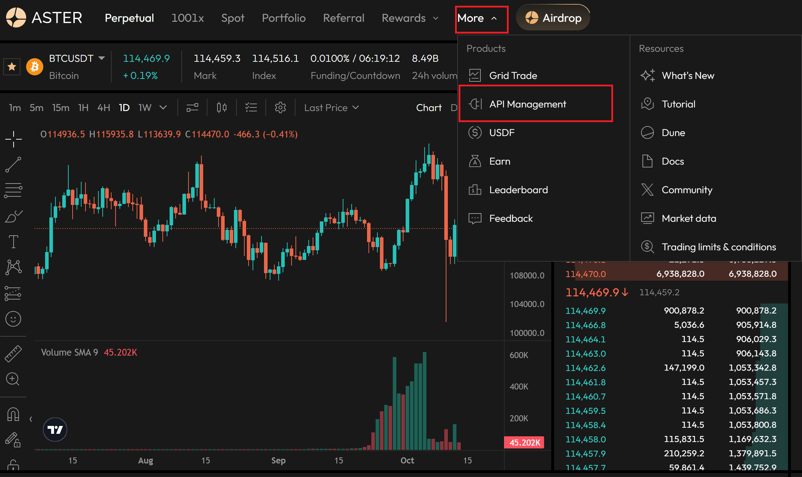
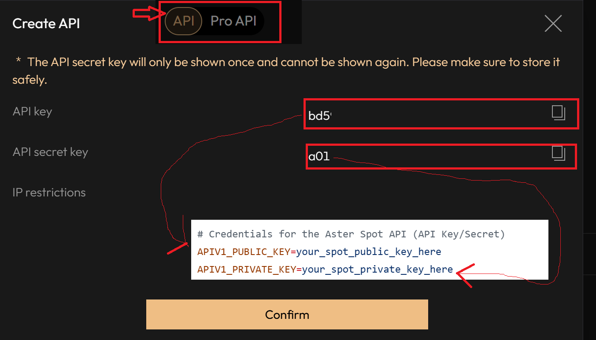
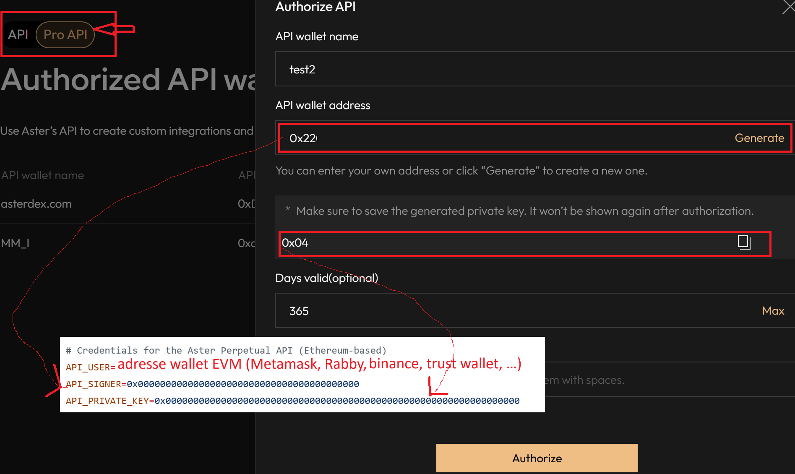
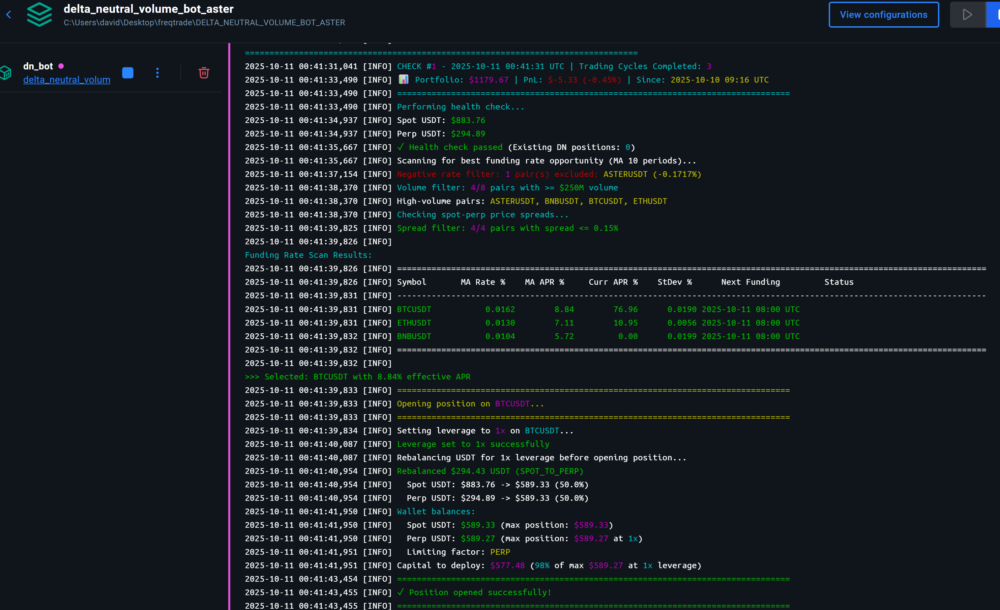

# Delta-Neutral Funding Rate Farming Bot on ASTER DEX Perp Spot

An automated, delta-neutral trading bot for the Aster DEX that operates on both spot and perpetual markets to capture funding payments while minimizing directional market risk.

> Referral link to support this work: https://www.asterdex.com/en/referral/164f81 . Earn 10% rebate on fees (I put maximum for you).

> This bot is ideal for the Stage 3 of Aster airdrop, as it will farm both perpetual and spot volume for you.

> ⚠️ I put the `fee_coverage_multiplier` in `config_volume_farming_strategy.json` to `0.2` that is a bit agressive to make more turnover and volume for farming the airdrop.

The bot continuously scans for profitable funding rate opportunities, opens positions, monitors them until fees are covered, and rotates to maximize returns.

## ⚙️ How It Works

The bot operates in a continuous loop:

1.  **Health Check**: Verifies account health, balances, and existing positions before any action.
2.  **Position Monitoring**: If a position is open, it's monitored for exit conditions:
    *   **Fee coverage**: Funding payments cover entry/exit fees (configurable multiplier). When reached, closes position and reopens best opportunity (can be same or different symbol).
    *   **Opportunistic rotation**: A **different symbol** with significantly better opportunity exists (configurable multiplier, default 2x APR after 4 hours). Only rotates to different symbols to avoid wasting fees.
    *   Maximum position age is reached.
    *   Emergency stop-loss is triggered.
    *   **Note**: Same-symbol rotation prevention applies only to opportunistic rotations (better APR found). Fee coverage always closes and reopens, even if same symbol remains best.
3.  **Opportunity Scanning**: If no position is open, it scans all delta-neutral pairs for the most profitable and stable funding rate APR, filtering out:
    *   Pairs with negative current funding rates (even if MA is positive).
    *   Pairs with < $250M 24h trading volume.
    *   Pairs with spot-perp price spread > 0.15%.
    *   Pairs with APR below the configured minimum threshold.
4.  **Open Position**: Automatically calculates position size, rebalances USDT between spot and perpetual wallets, and executes trades to open a new delta-neutral position (long spot, short perpetuals).
5.  **Repeat**: Saves its state and repeats the cycle.

## ✨ Features

-   **Fully Automated**: 24/7 operation for scanning, opening, monitoring, and closing positions.
-   **Delta-Neutral**: Minimizes directional risk with balanced spot and perpetual positions.
-   **Funding Rate Arbitrage**: Profits from collecting funding payments on perpetuals (every 8 hours at 00:00, 08:00, 16:00 UTC).
-   **Configurable Leverage**: Support for 1x-3x leverage with automatic capital allocation and safe transitions.
-   **Hybrid MA Filtering**: Uses a moving average of funding rates (combining 1 current/next rate + N-1 historical rates) to balance responsiveness with stability, while displaying both MA and current APR for comparison.
-   **Forced Rotation**: Automatically rotates to **different symbols** with significantly better opportunities when position age threshold is met (configurable, enabled by default). Never rotates to the same symbol to avoid wasting fees.
-   **Dynamic Pair Discovery**: Automatically finds all tradable delta-neutral pairs.
-   **Volume Filtering**: Only trades pairs with ≥ $250M 24h volume to ensure sufficient liquidity and minimize slippage.
-   **Negative Rate Filtering**: Automatically excludes pairs with negative current funding rates, even if their MA is positive.
-   **Spread Filtering**: Only trades pairs with spot-perp price spread ≤ 0.15% to ensure tight price alignment and safe execution.
-   **State Persistence**: Resumes seamlessly from `volume_farming_state.json` after restarts.
-   **Configurable**: Tune all parameters via `config_volume_farming_strategy.json`.
-   **Risk Management**: Includes automatic stop-loss calculation, health checks, and leverage management.
-   **Long-term Portfolio PnL Tracking**: Real-time total portfolio value with performance tracking from initial baseline.
-   **Comprehensive Position PnL Tracking**: Separate tracking for spot, perp, and combined strategy PnL including fees and funding.
-   **Colorful Terminal Output**: Enhanced visual interface with color-coded messages for easy monitoring.
-   **Clean Architecture**: Modular code with a clear separation of concerns.
-   **Dockerized**: Easy to deploy with Docker and Docker Compose.

## 🏗️ Architecture

-   **`aster_api_manager.py`**: Handles all API interactions (spot, perpetual, auth, transfers).
-   **`strategy_logic.py`**: Contains the pure computational logic for calculations and risk assessment.
-   **`volume_farming_strategy.py`**: Implements the main strategy loop, state management, and decision-making.
-   **`utils.py`**: Provides shared utility functions.

## 🔍 Utility Scripts

### Check Funding Rates and Volume Filtering

Use `check_funding_rates.py` to analyze funding rates without running the bot:

```bash
python check_funding_rates.py
```

This script displays:
-   **Current funding rates (APR)** for all delta-neutral pairs
-   **24h trading volume** for each pair
-   **Pairs meeting requirements** (≥ $250M volume AND positive current funding rate)
-   **Pairs filtered out** by insufficient volume or negative rates
-   **Summary statistics** including best opportunity

This is useful for:
-   Understanding which pairs are eligible for trading
-   Identifying the most profitable funding rate opportunities
-   Monitoring volume and funding rate requirements before starting the bot
-   Debugging why certain pairs aren't being traded (negative rates, low volume, etc.)

### Check Spot-Perp Price Spreads

Use `check_spot_perp_spreads.py` to analyze price spreads between spot and perpetual markets:

```bash
python check_spot_perp_spreads.py
```

This script displays:
-   **Spot mid price** and **perp mid price** for all delta-neutral pairs
-   **Absolute spread** (in dollars) and **percentage spread** between spot and perp
-   **Color-coded warnings** for large spreads (red: ≥0.1%, yellow: ≥0.05%, green: <0.05%)
-   **Summary statistics** including average spread, largest/smallest spreads, premium/discount counts

This is useful for:
-   Identifying pairs with liquidity issues or market inefficiencies
-   Understanding why pairs with good funding rates might be filtered out
-   Detecting arbitrage opportunities between spot and perp markets
-   Monitoring price alignment before opening delta-neutral positions

### Emergency Exit

Use `emergency_exit.py` to manually close your delta-neutral position immediately:

```bash
python emergency_exit.py
```

This script will:
-   **Read current position** from `volume_farming_state.json`
-   **Display position details** (symbol, leverage, capital, entry price, opened time)
-   **Show current PnL** (perpetual, spot, combined, net including fees and funding)
-   **Ask for confirmation** before executing
-   **Close both legs simultaneously** using market orders (spot sell + perp position close)
-   **Update state file** after successful closure

This is useful for:
-   Emergency situations requiring immediate position closure
-   Manual intervention when bot behavior is unexpected
-   Quickly exiting positions before major market events
-   Testing position closure without waiting for bot cycle

**⚠️ Warning:** This uses market orders which may have slippage. Use only when necessary.

## 📋 Prerequisites

> -   [Docker](https://www.docker.com/get-started) & [Docker Compose](https://docs.docker.com/compose/install/)
> -   Python 3.8+ (if not using Docker)
> -   Aster DEX API credentials (v1 and v3)

## 🛠️ Installation and Configuration

### 1. Clone the Repository

### 2. Set Up API Keys

Create a `.env` file from the example and add your API credentials.

```bash
cp .env.example .env
```

#### Getting Your API Credentials

First, navigate to **API Management** on Aster DEX by clicking **More** → **API Management**:



You need to create **two types of API keys** on Aster DEX:

**1. API v1 Credentials (Spot API):**

Navigate to the API section and select "API" (not Pro API):



This will give you:
- `APIV1_PUBLIC_KEY` - Your API key
- `APIV1_PRIVATE_KEY` - Your API secret key

**2. API v3 Credentials (Perpetual API):**

Navigate to the API section and select "Pro API":



This will give you:
- `API_USER` - Your EVM wallet address (e.g., from Metamask, Rabby, etc.)
- `API_SIGNER` - The generated signer address
- `API_PRIVATE_KEY` - The generated private key

> **⚠️ Important:** Both API keys will only be shown once! Make sure to save them securely.

#### Configure Your `.env` File

Edit `.env` with your Aster exchange API keys:

```env
# Aster API v3 Credentials (Perpetual API - Pro API)
API_USER="your_eth_wallet_address"
API_SIGNER="your_api_signer_key"
API_PRIVATE_KEY="your_api_private_key"

# Aster API v1 Credentials (Spot API - API)
APIV1_PUBLIC_KEY="your_v1_public_key"
APIV1_PRIVATE_KEY="your_v1_private_key"
```

> **Note:** Never commit your `.env` file. Both sets of credentials are required for the bot to function.

### 3. Configure the Strategy

Edit `config_volume_farming_strategy.json` to tune the bot's parameters.

| Parameter                 | Description                                                                 | Default |
| ------------------------- | --------------------------------------------------------------------------- | ------- |
| `capital_fraction`        | Percentage of available USDT to use per position.                           | `0.96`  |
| `min_volume_threshold`    | Minimum 24h volume threshold for a pair to be considered (in USDT).         | `250_000_000` |
| `min_funding_apr`         | Minimum annualized APR to consider for an opportunity.                      | `5.4`   |
| `use_funding_ma`          | Use hybrid MA (current + historical rates) for balanced responsiveness.     | `false` |
| `funding_ma_periods`      | Number of periods for the funding rate moving average.                      | `10`    |
| `fee_coverage_multiplier` | Close when funding covers fees by this factor (e.g., 0.2 = 20% for fast rotation). | `0.2`   |
| `max_position_age_hours`  | Maximum hours to hold a position before rotating.                           | `336`   |
| `loop_interval_seconds`   | Seconds to wait between each strategy cycle (300 = 5 minutes).              | `300`   |
| `leverage`                | Leverage for perpetual positions (1-3). Higher = more capital efficient.    | `1`     |
| `enable_forced_rotation`  | Enable forced rotation when a significantly better opportunity exists.      | `true`  |
| `forced_rotation_min_hours` | Minimum hours before considering forced rotation to better opportunity.   | `8.0`   |
| `forced_rotation_apr_multiplier` | New APR must be at least this multiplier × current APR to force rotation. | `2.0` |

**Note:** Stop-loss is **automatically calculated** based on leverage (not a manual parameter).

### 4. Fund account with USDT (perp or spot, it will automatically rebalance)
* **If BTC is selected as best opportunity, you may need at least 0.001 BTC times 2 in USDT (Aster's limitation)**, so about >235 USDT (as of October 14th, 2025)
* **Avoid having asBNB or USDF for perp account collateral, it may cause problems. Only have USDT.**

## 🚀 Usage

### With Docker (Recommended)

```bash
# Start the bot
docker-compose up --build

# Run in the background
docker-compose up --build -d

# View logs
docker-compose logs -f

# Stop the bot
docker-compose down
```

### Without Docker

```bash
# Install dependencies
pip install -r requirements.txt

# Run the bot
python volume_farming_strategy.py
```

## 📊 Monitoring

-   **Logs**: All activity is logged to the console and `volume_farming.log`.
-   **State**: The bot's current state is saved in `volume_farming_state.json`. The bot resumes from this file on restart.
-   **Cycle Counting**: The bot tracks two metrics:
    -   **Check iterations**: How many times the bot has checked positions (displayed as "CHECK #N")
    -   **Trading cycles completed**: How many complete position lifecycles finished (open → hold → close), stored in `cycle_count`
-   **Portfolio PnL Tracking**: The bot displays comprehensive PnL tracking:
    -   **Total Portfolio Value**: Real-time value of all holdings (spot assets + perp wallet + unrealized PnL)
    -   **Long-term PnL**: Total profit/loss since bot started, displayed in each cycle header with baseline timestamp
    -   **Perp Unrealized PnL**: PnL from the short perpetual position (used for stop-loss trigger)
    -   **Spot Unrealized PnL**: PnL from the long spot position
    -   **Combined DN PnL (net)**: Total strategy PnL including funding received and all fees
-   **Colorful Terminal Output**: Enhanced visual output with color-coded messages for easy monitoring
    -   Green for profits and success, Red for losses and errors
    -   Yellow for warnings, Cyan for information, Magenta for important values
-   **UTC Timestamps**: All timestamps (position opened, cycles, funding times) are displayed in UTC for consistency
-   **Multi-Layer Filtering**: Four-stage filtering process ensures only high-quality pairs are traded:
    1. Volume filter (≥ $250M 24h volume)
    2. Negative rate filter (current funding rate must be positive)
    3. Spread filter (≤ 0.15% spot-perp price spread)
    4. APR threshold (meets minimum funding rate requirement)
-   **Dual APR Display**: When using MA mode, the funding rate table shows both:
    - **MA APR %**: Stable moving average used for position selection
    - **Curr APR %**: Real-time instantaneous APR for comparison and trend analysis



> ## ⚠️ Disclaimer
>
> **Trading cryptocurrencies involves significant risk.** This bot is provided as-is, without any warranty or guarantee of profitability. The authors are not responsible for any financial losses. Use at your own risk and only trade with capital you can afford to lose.
