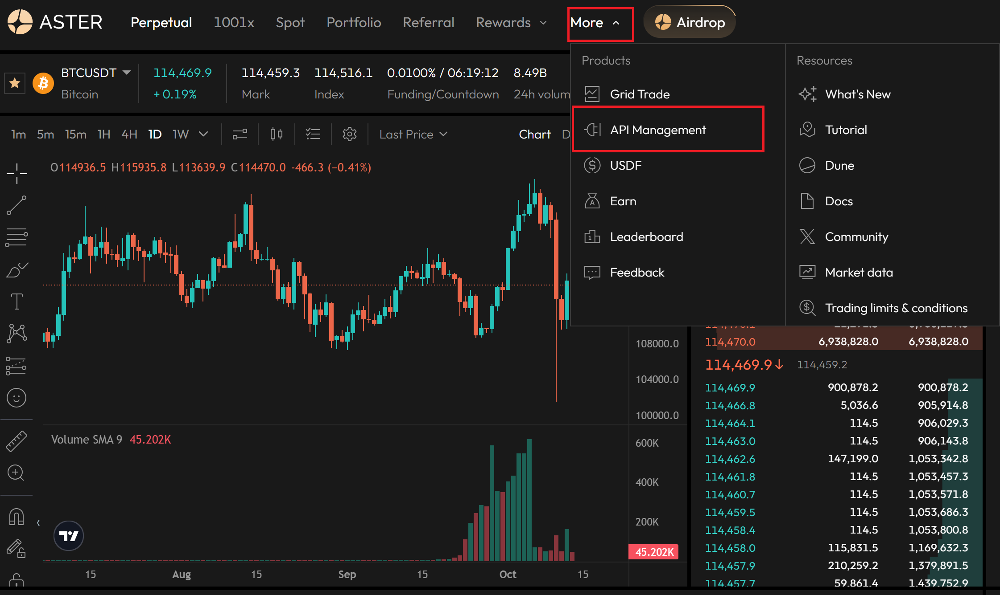
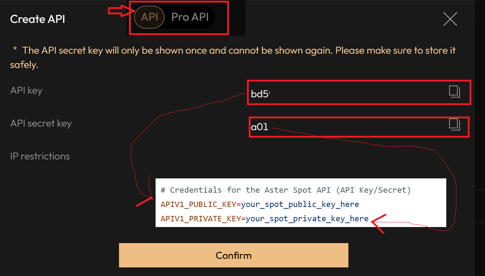
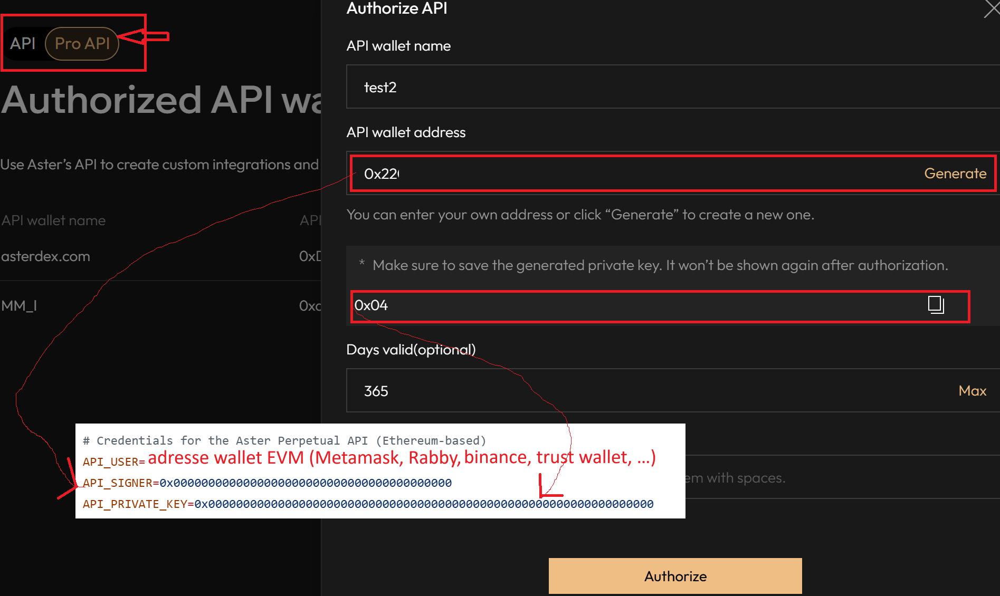
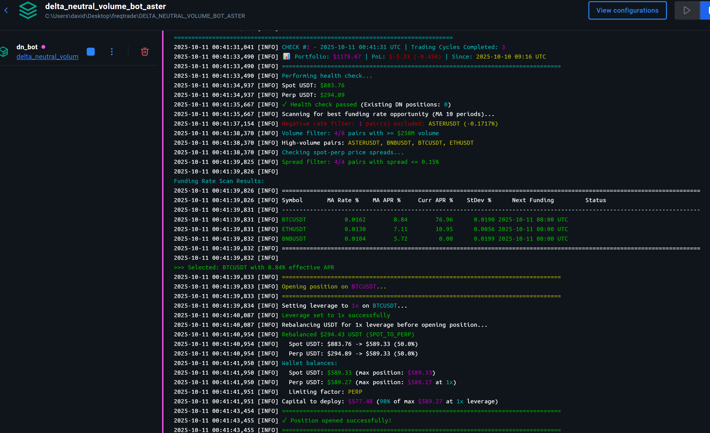

# Delta-Neutral Funding Carry Bot on ASTER DEX (Perp + Spot)

An automated delta-neutral bot for Aster DEX: it holds **long spot + short perpetual** on the same coin, so price moves cancel and it collects the funding the perp short receives.

> Referral link to support this work: https://www.asterdex.com/en/referral/164f81 . Earn 10% rebate on fees (I put maximum for you).

> The bot used to churn positions to farm airdrop volume. The airdrop is over, so it now holds positions for weeks and only rotates when another pair pays clearly more. (File names such as `volume_farming_strategy.py` are historical.)

## ⚙️ How It Works

Every cycle (5 minutes by default):

1. **Monitor the open position** using positions read from the exchange. The bot's spot leg is `min(spot balance, tracked quantity)`, so coins you hold yourself are ignored. Checks run in this order:
   - **Stop-loss** on perp PnL, 70% of the way to liquidation: -69% at 1x, -34% at 2x, -22% at 3x, measured against the perp notional. Leverage is taken from the position, not the config.
   - **Broken hedge** (a leg missing, or imbalance over 2%): close whatever is left.
   - **Funding turned against us** (the held pair's 7-day average APR ≤ -`min_funding_apr`): close.
   - **Rotation**: after `min_hold_days`, close if another pair's 7-day APR beats the held one by `rotation_min_apr_gain` points.
   - If account data can't be fetched, the bot **holds** and retries. It never acts on missing data.
2. **Close** the perp first (reduce-only), then sell the bot's spot only once the perp reads flat. The bot never opens in a cycle that closed or tried to close; a failed close is retried next cycle.
3. **Open** when nothing is tracked:
   - Any untracked perp position blocks opening. A clean hedge is adopted; anything else writes `halt.json` and the bot stops opening.
   - The best pair must pass every filter: listed on both markets, a two-sided spot and perp book, predicted funding ≥ 0, ≥ $250M 24h volume, spot/perp basis ≤ 0.15%, and 7-day average APR ≥ `min_funding_apr`. A pair with missing data is excluded (several paired coins have one-sided or empty spot books).
   - Legs go out **one at a time**, spot first; the perp hedge is sized from the spot actually received. Each leg is verified by reading the position back, and a failed leg is unwound.
   - If an unwind fails, or the spot filled but the hedge didn't, the bot writes `halt.json`.

**Why these thresholds**
- A round trip costs about 0.4% of notional: 4 taker legs at 0.1%, deliberately conservative until real fills are measured.
- Paying that back over a ~30-day hold with a 2× margin needs about 10% APR: 2 × 0.4% × 365/30.
- That one figure sets both the entry threshold and the rotation gain. When no pair qualifies, the bot waits in USDT.

**`halt.json`**: while this file exists the bot keeps monitoring and closing, but never opens. Check both markets on the exchange, then delete the file to resume.

## 🏗️ Architecture

- **`aster_api_manager.py`**: API layer (auth, market data, transfers), plus `open_dn` / `close_dn` for the two legs.
- **`two_leg.py`**: shared safety primitive (sequential legs, fill verification, unwind, halt file). Keep it byte-identical across bots.
- **`strategy_logic.py`**: pure functions (hedge detection, APR, stop-loss, exit rule).
- **`volume_farming_strategy.py`**: the loop, the funding scan, decisions and state.

## 🔍 Utility Scripts

```bash
python check_funding_rates.py      # the bot's own funding scan, without trading
python check_spot_perp_spreads.py  # spot vs perp mid-price spread for every pair
python get_volume_24h.py           # 24h spot and perp volume per pair
python emergency_exit.py           # halt the bot, then close the tracked position
```

**Emergency exit** does the following:
1. Asks for confirmation.
2. Writes `halt.json`, so a running bot can't reopen.
3. Closes the perp first, then the bot's spot.
4. Clears the position from state only if both legs read closed.

Delete `halt.json` afterwards to let the bot trade again. It uses market orders, so expect slippage.

## 📋 Prerequisites

> -   [Docker](https://www.docker.com/get-started) & [Docker Compose](https://docs.docker.com/compose/install/)
> -   Python 3.9+ (if not using Docker)
> -   Aster DEX API credentials (v1 and v3)

## 🛠️ Installation and Configuration

### 1. Clone the Repository

### 2. Set Up API Keys

API keys go in `aster.env`, next to the scripts. It is git-ignored, so it is never committed. Create it from the tracked template:

```bash
cp aster.env.example aster.env
```

`config_volume_farming_strategy.json` holds strategy settings only; never put keys in it.

#### Getting Your API Credentials

First, navigate to **API Management** on Aster DEX by clicking **More** → **API Management**:



You need to create **two types of API keys** on Aster DEX:

**1. API v1 Credentials (Spot API):**

Navigate to the API section and select "API" (not Pro API):



This will give you:
- `APIV1_PUBLIC_KEY` - Your API key
- `APIV1_PRIVATE_KEY` - Your API secret key

**2. API v3 Credentials (Perpetual API):**

Navigate to the API section and select "Pro API":



This will give you:
- `API_USER` - Your EVM wallet address (e.g., from Metamask, Rabby, etc.)
- `API_SIGNER` - The generated signer address
- `API_PRIVATE_KEY` - The generated private key

> **⚠️ Important:** Both API keys will only be shown once! Make sure to save them securely.

#### Fill In `aster.env`

```env
# Pro API (perpetual, v3)
API_USER=0xYourWalletAddress
API_SIGNER=0xGeneratedSignerAddress
API_PRIVATE_KEY=0xGeneratedPrivateKey

# API (spot, v1)
APIV1_PUBLIC_KEY=your_v1_public_key
APIV1_PRIVATE_KEY=your_v1_private_key
```

> **Note:** Both sets of credentials are required.
> - Docker reads the file through `env_file` in `docker-compose.yml`; the scripts load it themselves.
> - A missing or placeholder value stops the bot at startup with a message naming the key.

### 3. Configure the Strategy

Edit `config_volume_farming_strategy.json`:

| Parameter               | Description                                                                 | Default |
| ----------------------- | --------------------------------------------------------------------------- | ------- |
| `capital_fraction`      | Fraction of the rebalanced USDT deployed per position.                      | `0.96`  |
| `min_funding_apr`       | Entry needs the `funding_avg_days` average funding APR ≥ this (%).          | `10.0`  |
| `funding_avg_days`      | Averaging window for funding APR (settled rates + the predicted next one). | `7`     |
| `min_hold_days`         | No rotation before this age.                                                | `7`     |
| `rotation_min_apr_gain` | Rotate only if another pair beats the held one by this many APR points.     | `10.0`  |
| `loop_interval_seconds` | Seconds between cycles (the stop-loss is checked every cycle).              | `300`   |
| `leverage`              | Perp leverage 1-3. 1 = 50/50 spot/perp, 2 = 67/33, 3 = 75/25.               | `1`     |

The stop-loss is automatic (see above). Changing `leverage` only affects the next position.

### 4. Fund the account with USDT (perp or spot; the bot rebalances)
* **Minimum size:** each position must be at least 3 perp lot steps and above the minimum notional. For BTC, 3 × 0.001 BTC is about $252 per leg at ~$84k (30 Sep 2026).
  * At 1x that means about **$530 USDT in total**: both legs plus the 4% buffer.
  * Leverage lowers the total: 1 / (0.96 × L/(L+1)) × $252 gives about $395 at 2x and $350 at 3x.
* **Use an account dedicated to the bot:**
  * Keep perp collateral in USDT only (asBNB or USDF collateral may cause problems).
  * Don't deposit or withdraw while a position is open: realized PnL is measured from your USDT balances.
  * Coins you hold of the traded asset are never sold. But if the state file is lost, they make a live position look unbalanced, and the bot halts instead of adopting it.

## ⬆️ Upgrading from the volume-farming version

1. **Back up `volume_farming_state.json` before `git pull`.** It is no longer tracked by git, so the pull deletes your copy. Restore it afterwards.
2. **Config keys changed.** The repo config has the new keys, and old ones (`fee_coverage_multiplier`, `use_funding_ma`, `forced_rotation_*`, `max_position_age_hours`, …) are ignored. Merge any local edits by hand.
3. **Rename your credentials file:** `mv .env aster.env`. The bot and docker-compose no longer read `.env`.
4. **A position that is open during the upgrade is kept and monitored.** Its realized PnL is logged as unknown, because the old version didn't record entry cash.
5. **Run one small cycle first** (`capital_fraction` ≈ 0.05). Check the logged spot order response for which asset the fees are charged in, and compare the realized-PnL breakdown with the exchange.

## 🚀 Usage

### With Docker (Recommended)

```bash
docker-compose up --build        # start
docker-compose up --build -d     # start in the background
docker-compose logs -f           # follow logs
docker-compose down              # stop (an open position stays open; restart to keep monitoring it)
```

### Without Docker

```bash
pip install -r requirements.txt
python volume_farming_strategy.py
```

### Tests

```bash
python -m pytest tests -q   # offline: a fake exchange, no network, no keys
```

## 📊 Monitoring

- **Logs**: console plus `volume_farming.log` (rotated at 10 MB, 3 files).
- **State**: `volume_farming_state.json` holds the tracked position, its entry cash and the counters. If it's lost, a live clean hedge is re-adopted from the exchange.
- **Each cycle logs:**
  - portfolio value and PnL since the first run (spot at the spot bid, plus perp wallet, plus unrealized PnL);
  - the funding table (current and 7-day APR for pairs that pass the filters, and the held pair);
  - perp PnL against the stop;
  - the holding summary.
- **On close:** realized PnL, measured as the USDT change across both wallets, split into **funding** and **fees + basis + slippage**. This shows where money is really made or lost.



*(Screenshot from the earlier volume-farming version; the log layout has changed.)*

> ## ⚠️ Disclaimer
>
> **Trading cryptocurrencies involves significant risk.** This bot is provided as-is, without any warranty or guarantee of profitability. The authors are not responsible for any financial losses. Use at your own risk and only trade with capital you can afford to lose.
