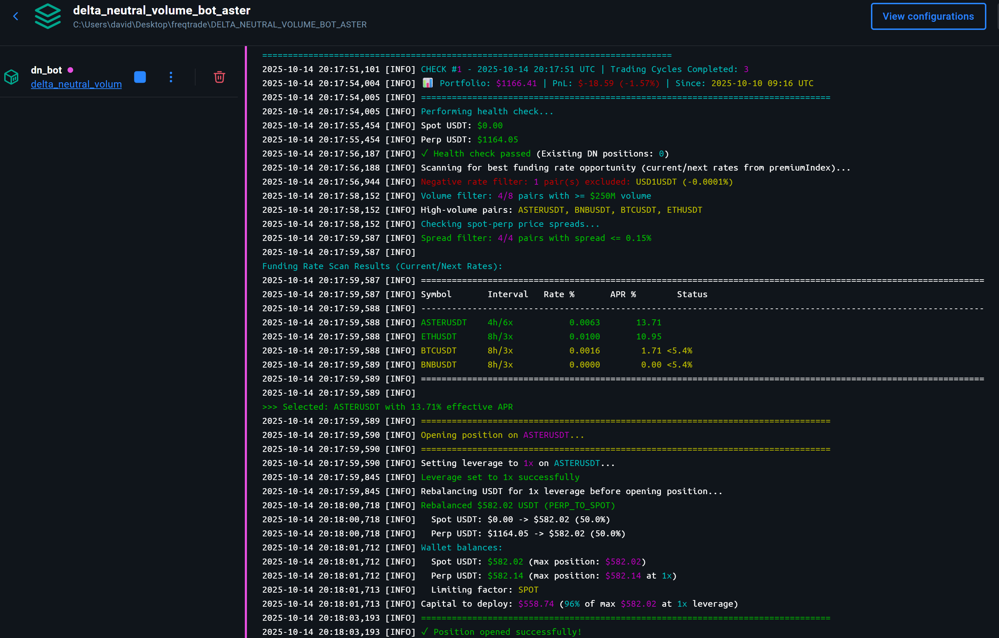

# Delta-Neutral Funding Rate Farming Bot on ASTER DEX Perp Spot

An automated, delta-neutral trading bot for the Aster DEX that operates on both spot and perpetual markets to capture funding payments while minimizing directional market risk.

> Referral link to support this work: https://www.asterdex.com/en/referral/164f81 . Earn 10% rebate on fees (I put maximum for you).

> This bot is ideal for the Stage 3 of Aster airdrop, as it will farm both perpetual and spot volume for you.

The bot continuously scans for profitable funding rate opportunities, opens positions, monitors them until fees are covered, and rotates to maximize returns.

## ⚙️ How It Works

The bot operates in a continuous loop:

1.  **Health Check**: Verifies account health, balances, and existing positions before any action.
2.  **Position Monitoring**: If a position is open, it's monitored for exit conditions:
    *   Funding payments cover entry/exit fees (configurable multiplier).
    *   A better funding rate opportunity is found.
    *   Maximum position age is reached.
    *   Emergency stop-loss is triggered.
3.  **Opportunity Scanning**: If no position is open, it scans all delta-neutral pairs for the most profitable and stable funding rate APR.
4.  **Open Position**: Automatically calculates position size, rebalances USDT between spot and perpetual wallets, and executes trades to open a new delta-neutral position (long spot, short perpetuals).
5.  **Repeat**: Saves its state and repeats the cycle.

## ✨ Features

-   **Fully Automated**: 24/7 operation for scanning, opening, monitoring, and closing positions.
-   **Delta-Neutral**: Minimizes directional risk with balanced spot and perpetual positions.
-   **Funding Rate Arbitrage**: Profits from collecting funding payments on perpetuals (every 8 hours at 00:00, 08:00, 16:00 UTC).
-   **Configurable Leverage**: Support for 1x-3x leverage with automatic capital allocation and safe transitions.
-   **MA Filtering**: Uses a funding rate moving average to avoid volatile, short-lived opportunities.
-   **Dynamic Pair Discovery**: Automatically finds all tradable delta-neutral pairs.
-   **State Persistence**: Resumes seamlessly from `volume_farming_state.json` after restarts.
-   **Configurable**: Tune all parameters via `config_volume_farming_strategy.json`.
-   **Risk Management**: Includes automatic stop-loss calculation, health checks, and leverage management.
-   **Long-term Portfolio PnL Tracking**: Real-time total portfolio value with performance tracking from initial baseline.
-   **Comprehensive Position PnL Tracking**: Separate tracking for spot, perp, and combined strategy PnL including fees and funding.
-   **Colorful Terminal Output**: Enhanced visual interface with color-coded messages for easy monitoring.
-   **Clean Architecture**: Modular code with a clear separation of concerns.
-   **Dockerized**: Easy to deploy with Docker and Docker Compose.

## 🏗️ Architecture

-   **`aster_api_manager.py`**: Handles all API interactions (spot, perpetual, auth, transfers).
-   **`strategy_logic.py`**: Contains the pure computational logic for calculations and risk assessment.
-   **`volume_farming_strategy.py`**: Implements the main strategy loop, state management, and decision-making.
-   **`utils.py`**: Provides shared utility functions.

## 📋 Prerequisites

> -   [Docker](https://www.docker.com/get-started) & [Docker Compose](https://docs.docker.com/compose/install/)
> -   Python 3.8+ (if not using Docker)
> -   Aster DEX API credentials (v1 and v3)

## 🛠️ Installation and Configuration

### 1. Clone the Repository

```bash
git clone <repository_url>
cd DELTA_NEUTRAL_VOLUME_BOT_ASTER
```

### 2. Set Up API Keys

Create a `.env` file from the example and add your API credentials.

```bash
cp .env.example .env
```

#### Getting Your API Credentials

You need to create **two types of API keys** on Aster DEX:

**1. API v1 Credentials (Spot API):**

Navigate to the API section and select "API" (not Pro API):


This will give you:
- `APIV1_PUBLIC_KEY` - Your API key
- `APIV1_PRIVATE_KEY` - Your API secret key

**2. API v3 Credentials (Perpetual API):**

Navigate to the API section and select "Pro API":


This will give you:
- `API_USER` - Your EVM wallet address (e.g., from Metamask, Rabby, etc.)
- `API_SIGNER` - The generated signer address
- `API_PRIVATE_KEY` - The generated private key

> **⚠️ Important:** Both API keys will only be shown once! Make sure to save them securely.

#### Configure Your `.env` File

Edit `.env` with your Aster exchange API keys:

```env
# Aster API v3 Credentials (Perpetual API - Pro API)
API_USER="your_eth_wallet_address"
API_SIGNER="your_api_signer_key"
API_PRIVATE_KEY="your_api_private_key"

# Aster API v1 Credentials (Spot API - API)
APIV1_PUBLIC_KEY="your_v1_public_key"
APIV1_PRIVATE_KEY="your_v1_private_key"
```

> **Note:** Never commit your `.env` file. Both sets of credentials are required for the bot to function.

### 3. Configure the Strategy

Edit `config_volume_farming_strategy.json` to tune the bot's parameters.

| Parameter                 | Description                                                                 | Default |
| ------------------------- | --------------------------------------------------------------------------- | ------- |
| `capital_fraction`        | Percentage of available USDT to use per position.                           | `0.98`  |
| `min_funding_apr`         | Minimum annualized APR to consider for an opportunity.                      | `5.4`   |
| `use_funding_ma`          | Use a moving average of funding rates for stability.                        | `true`  |
| `funding_ma_periods`      | Number of periods for the funding rate moving average.                      | `10`    |
| `fee_coverage_multiplier` | Close when funding covers fees by this factor (e.g., 1.8 = 180%).           | `1.1`   |
| `max_position_age_hours`  | Maximum hours to hold a position before rotating.                           | `336`   |
| `loop_interval_seconds`   | Seconds to wait between each strategy cycle.                                | `900`   |
| `leverage`                | Leverage for perpetual positions (1-3). Higher = more capital efficient.    | `3`     |

**Note:** Stop-loss is **automatically calculated** based on leverage (not a manual parameter).

## 🚀 Usage

### With Docker (Recommended)

```bash
# Start the bot
docker-compose up --build

# Run in the background
docker-compose up --build -d

# View logs
docker-compose logs -f

# Stop the bot
docker-compose down
```

### Without Docker

```bash
# Install dependencies
pip install -r requirements.txt

# Run the bot
python volume_farming_strategy.py
```

## 📊 Monitoring

-   **Logs**: All activity is logged to the console and `volume_farming.log`.
-   **State**: The bot's current state is saved in `volume_farming_state.json`. The bot resumes from this file on restart.
-   **Portfolio PnL Tracking**: The bot displays comprehensive PnL tracking:
    -   **Total Portfolio Value**: Real-time value of all holdings (spot assets + perp wallet + unrealized PnL)
    -   **Long-term PnL**: Total profit/loss since bot started, displayed in each cycle header with baseline timestamp
    -   **Perp Unrealized PnL**: PnL from the short perpetual position (used for stop-loss trigger)
    -   **Spot Unrealized PnL**: PnL from the long spot position
    -   **Combined DN PnL (net)**: Total strategy PnL including funding received and all fees
-   **Colorful Terminal Output**: Enhanced visual output with color-coded messages for easy monitoring
    -   Green for profits and success, Red for losses and errors
    -   Yellow for warnings, Cyan for information, Magenta for important values
-   **UTC Timestamps**: All timestamps (position opened, cycles, funding times) are displayed in UTC for consistency



## 📌 Important Notes

> **Leverage**: The bot supports configurable leverage (1x-3x) via the config file.
> - **1x leverage**: 50/50 split between spot and perp - safest option
> - **2x leverage**: 67% spot / 33% perp - moderate risk, better capital efficiency
> - **3x leverage** (default): 75% spot / 25% perp - higher risk, maximum capital efficiency
>
> The bot automatically sets leverage on the exchange and maintains the same position size on both sides. Leverage changes only apply to new positions, never mid-position. **Important:** When using higher leverage (2x-3x), ensure your `emergency_stop_loss_pct` is set appropriately (default: -20%) to avoid liquidation. See [LEVERAGE_FEATURE.md](LEVERAGE_FEATURE.md) for details.

> **Capital**: A minimum of **$50 USDT** is recommended (split according to leverage setting). The bot automatically rebalances USDT between wallets based on your leverage configuration.

> **Fees**: Entry and exit fees are ~0.1% each. The bot ensures funding payments cover these fees before closing a position for profit.

## 🔍 Troubleshooting

-   **Position not tracked after restart?** Delete `volume_farming_state.json` and restart the bot. It will rediscover the position from the exchange.
-   **Insufficient balance errors?** Ensure you have USDT in both spot and perpetual wallets. The bot can auto-rebalance if the total balance is sufficient.
-   **No opportunities found?** Your `min_funding_apr` might be too high, or market conditions may not be favorable.
-   **Leverage mismatch warnings?** This is normal if you changed leverage in config while holding a position. The position maintains its original leverage until closed, then new positions use the new leverage setting.
-   **Spot PnL showing $0.00?** The bot will automatically fix this on the next position evaluation cycle by retrieving the entry price from the exchange.
-   **Health check failures with valid leverage?** Ensure your bot version supports 1x-3x leverage validation (not hardcoded to 1x only).
-   **Reset portfolio PnL baseline?** Delete `volume_farming_state.json` to reset the portfolio baseline. The bot will capture a new baseline on next start.
-   **Portfolio PnL incorrect after deposit/withdrawal?** The portfolio PnL tracking assumes no external transfers. If you deposited or withdrew funds, delete the state file to recapture the baseline.

## 🆕 Recent Improvements

**October 2025 Update:**
- ✅ **Long-term Portfolio PnL Tracking**: Tracks total portfolio performance from initial baseline with automatic asset valuation
  - Captures initial portfolio value (all spot assets + perp wallet + unrealized PnL)
  - Displays real-time total portfolio value and PnL in each cycle header
  - Shows both absolute ($) and relative (%) performance with baseline timestamp
  - Persists across bot restarts via state file
- ✅ **Enhanced Colorful Terminal Output**: Beautiful color-coded output for easier monitoring
  - Green for profits/success, Red for losses/errors, Yellow for warnings
  - Cyan for information, Magenta for important values
  - Dynamic colors based on PnL status and progress bars
- ✅ **Enhanced PnL Tracking**: Now displays separate Perp, Spot, and Combined DN PnL with funding and fees included
- ✅ **Entry Price Tracking**: Automatically saves and recovers entry prices for accurate spot PnL calculations
- ✅ **UTC Timestamps**: All times are now displayed in UTC for consistency (position opened, cycles, funding times)
- ✅ **Human-Readable Funding Times**: Next funding time shows as `YYYY-MM-DD HH:MM UTC` instead of raw timestamps
- ✅ **Improved Health Checks**: Now correctly validates 1x-3x leverage (no longer hardcoded to 1x)
- ✅ **Better Logging**: Clear labeling of what triggers stop-loss vs what shows overall strategy performance
- ✅ **Automatic Stop-Loss Calculation**: Stop-loss is now automatically calculated based on leverage with 0.7% safety buffer

## 📚 Additional Documentation

- **Strategy Guide**: [VOLUME_FARMING_GUIDE.md](VOLUME_FARMING_GUIDE.md) - Detailed strategy explanation
- **Leverage Feature**: [LEVERAGE_FEATURE.md](LEVERAGE_FEATURE.md) - Complete leverage documentation with examples
- **Implementation Details**: [LEVERAGE_IMPLEMENTATION_SUMMARY.md](LEVERAGE_IMPLEMENTATION_SUMMARY.md) - Technical implementation summary
- **Developer Guide**: [CLAUDE.md](CLAUDE.md) - Comprehensive guide for working with the codebase

> ## ⚠️ Disclaimer
>
> **Trading cryptocurrencies involves significant risk.** This bot is provided as-is, without any warranty or guarantee of profitability. The authors are not responsible for any financial losses. Use at your own risk and only trade with capital you can afford to lose.
